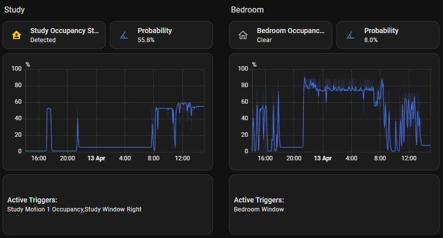

# Area Occupancy Detection for Home Assistant


[](https://github.com/Hankanman/Area-Occupancy-Detection/releases)
[](https://analytics.home-assistant.io/custom_integrations.json)


[](https://buymeacoffee.com/sebburrell)

Have you ever had your lights turn off while you're still in the room? Or watched your smart home mark you as "away" while you're sitting perfectly still, watching TV? These frustrating experiences happen because most occupancy detection relies on simple motion sensors that can't understand context.

**Area Occupancy Detection** solves these real-world problems by thinking more intelligently about what "occupied" really means. Instead of just checking if motion was detected, it combines multiple clues, learns from your patterns, and calculates the probability that someone is actually there.

**Area Occupancy Detection doesn't automate anything for you**—it provides the intelligent occupancy information you need to create reliable automations. AOD creates sensors that your automations can use to control lights, heating, and other devices. Think of AOD as the "smart sensor" that gives your automations better data to work with.

## The Quick Answer

**Here's why AOD is different:**

**HA**: "Motion detected? Occupied. Motion stopped? Not occupied."

🎯 **AOD**: "Let me check motion, TV, doors, appliances, learned patterns, and time of day... 75% confident someone is there."

**HA**: You configure everything manually. It never learns.

🧠 **AOD**: Learns from your history automatically. Gets smarter over time. Knows you're usually in the kitchen Sunday mornings.

**Core HA**: One sensor fails → wrong answer.

🔀 **AOD**: Combines multiple sensors intelligently. If motion misses you, TV being on maintains occupancy probability → your automations keep lights on.

**Core HA**: Motion stops → occupancy sensor turns off → automations turn lights off immediately.

⏱️ **AOD**: Motion stops → probability gradually decreases → occupancy sensor stays on longer → your automations keep lights on while you sit still.

**Core HA**: Basic features only.

✨ **AOD**: Activity detection (what's happening, not just who's there), sleep presence tracking, "Wasp in Box" for bathrooms, whole-home aggregation, purpose-based defaults.

**The bottom line:** AOD provides intelligent occupancy sensors that your automations can use. It learns, adapts, and understands context—so when you build automations that respond to occupancy, they work reliably instead of turning lights off while you're still in the room.

## Creating Automations with AOD

Here's how AOD fits into your automation workflow:

### The Workflow

1. **AOD analyzes your sensors** → Motion, TV, doors, appliances, learned patterns
2. **AOD calculates probability** → Combines all inputs using Bayesian inference
3. **AOD creates occupancy sensors** → Binary occupancy status and probability sensors
4. **Your automations use these sensors** → Trigger actions based on occupancy state or probability
5. **AOD learns and adapts** → Gets smarter over time, improving your automations automatically

### What AOD Provides

AOD creates sensors that your automations can use:

- **Occupancy Status**: Binary sensor (`on` = occupied, `off` = clear) - use this in most automations
- **Occupancy Probability**: Percentage (0-100%) - use this for conditional or gradual actions
- **Detected Activity**: What's happening in the room (showering, cooking, watching TV, sleeping, etc.) - use for context-aware automations
- **Sleeping**: Whether people are sleeping in the area - use for overnight occupancy
- **Presence Confidence / Environmental Confidence**: Split view of what's driving the probability
- **Prior Probability**: Baseline from learned patterns - useful for monitoring and debugging
- **Threshold**: Adjustable setting - fine-tune without reconfiguration

### How You Use It

You create automations that respond to AOD's sensors. For example:

- **Turn lights on** when occupancy status turns `on`
- **Turn lights off** when occupancy status turns `off` (with a delay to prevent flickering)
- **Adjust heating** based on occupancy probability
- **Dim lights gradually** as probability decreases

The key difference: AOD provides intelligent occupancy data. You decide what actions to take based on that data.



## Documentation

AOD is extensively documented [here](https://hankanman.github.io/Area-Occupancy-Detection/).

## Features

- **Bayesian Occupancy Detection**: Combines multiple sensor inputs using Bayesian probability for accurate occupancy detection.
- **Dual-Model Approach**: Separates presence indicators (motion, media, appliances, doors, windows, covers, power, sleep — 80% weight) from environmental support (temperature, humidity, CO2, etc. — 20% weight) for more accurate results.
- **Multiple Sensor Support**:
  - **Motion/Occupancy Sensors**: Primary input and ground truth for detecting presence.
  - **Media Devices**: TV, media players, and similar devices as activity indicators.
  - **Appliances**: Switches or sensors representing devices like fans, PCs, or other appliances.
  - **Cover Sensors**: Blinds, shades, shutters, and garage doors being operated.
  - **Environmental Sensors**: Temperature, humidity, illuminance, CO2, sound pressure, atmospheric pressure, air quality, VOC, PM2.5, and PM10 sensors contribute subtle occupancy clues.
  - **Doors and Windows**: Entry/exit and ventilation patterns.
  - **Power Sensors**: Power consumption as an activity indicator.
- **Activity Detection**: Identifies what activity is happening in a room (showering, cooking, watching TV, working, sleeping, eating, etc.) — constrained by room purpose so "showering" only appears in bathrooms.
- **Sleep Presence Detection**: Detects when people are sleeping using HA Person entities combined with phone sleep confidence from the Companion App, keeping bedrooms occupied overnight.
- **Probability-Based Output**: Provides an occupancy probability (1-99%) and a binary occupancy status based on a configurable threshold.
- **Time-Based Priors**: Learns occupancy patterns by **day of week** and **time of day**, adjusting probability dynamically based on historical usage.
- **Adaptive Historical Analysis**: Learns sensor reliability and priors over time, improving accuracy as it gathers data.
- **Probability Decay**: Gradually reduces occupancy probability when no new activity occurs, with purpose-based defaults.
- **Wasp in Box**: Virtual sensor for rooms with a single entry/exit point — maintains occupancy when the door closes after motion.
- **All Areas Aggregation**: Automatically creates aggregated entities across all configured areas for whole-home occupancy detection.
- **Real-Time Threshold Adjustment**: Modify the occupancy threshold without reconfiguration.
- **Weighted Sensor Contributions**: Fine-tune how much each sensor type influences the final probability.
- **Purpose-Based Defaults**: Selecting a room purpose (12 options from Passageway to Bedroom) automatically sets sensible decay timing.

## Planned Features

- **Machine Learning Model**: Train a neural network based on history to predict occupancy.
- **Auto-Adjusting Threshold**: Based on history and predictions, automatically adjust the threshold so the user doesn't need to.
- **Location Aware**: Leveraging BLE, WiFi, GPS.
- **Weather-Aware**: Integrate weather data into priors (cold and rainy → more likely to be indoors).
- **Occupancy Zone Hierarchies**:
  - **Parent-Child Area Relationships**: If the kitchen is occupied and the dining room is adjacent, allow probabilities to influence each other.
  - **Multi-Room Tracking**: Track movement across rooms for more continuous occupancy detection.
  - **Adjacent Area Detection**: Pre-heat or turn on devices as the probability rises based on motion in adjacent areas.

## Installation

## HACS

[](https://my.home-assistant.io/redirect/hacs_repository/?owner=Hankanman&repository=Area-Occupancy-Detection&category=integration)

1. **Ensure HACS is installed:** If you don't have the [Home Assistant Community Store (HACS)](https://hacs.xyz/) installed, follow their instructions to set it up first.
2. **Navigate to HACS:** Open your Home Assistant frontend and go to HACS in the sidebar.
3. **Search for Area Occupancy Detection:** Search for "Area Occupancy Detection" and select then **Download**.
4. **Restart Home Assistant:** After the download is complete, restart your Home Assistant instance

## Entities Created

The integration creates the following entities for each configured area. An "All Areas" aggregation device is also created automatically. See the [Entities documentation](https://hankanman.github.io/Area-Occupancy-Detection/features/entities/) for full details.

### Primary Entities

| Entity | Type | Description |
| --- | --- | --- |
| `binary_sensor.[area]_occupancy_status` | Binary Sensor | `on` when probability meets threshold, `off` otherwise |
| `sensor.[area]_occupancy_probability` | Sensor (%) | Current occupancy probability (0-100%) |
| `number.[area]_occupancy_threshold` | Number (%) | Adjustable threshold for occupancy status (1-99%) |
| `sensor.[area]_detected_activity` | Sensor (enum) | Current activity: showering, cooking, watching_tv, working, sleeping, idle, etc. |

### Diagnostic Entities

| Entity | Type | Description |
| --- | --- | --- |
| `sensor.[area]_presence_confidence` | Sensor (%) | Probability from presence indicators only (motion, media, covers, etc.) |
| `sensor.[area]_environmental_confidence` | Sensor (%) | Environmental support (50% = neutral, >50% supports occupancy) |
| `sensor.[area]_prior_probability` | Sensor (%) | Learned baseline probability from historical patterns |
| `sensor.[area]_evidence` | Sensor | Lists active/inactive sensors with detailed per-entity information |
| `sensor.[area]_decay_status` | Sensor (%) | Decay progress when probability is decreasing |
| `sensor.[area]_activity_confidence` | Sensor (%) | Confidence in the detected activity |

### Optional Entities

| Entity | Type | Description |
| --- | --- | --- |
| `binary_sensor.[area]_sleeping` | Binary Sensor | Sleep presence — `on` when people are sleeping (requires People configuration) |
| `binary_sensor.[area]_wasp_in_box` | Binary Sensor | Wasp in Box — maintains occupancy when door closes after motion (requires enabling) |

## Debugging

Enable debug logging in `configuration.yaml`:

```yaml
logger:
  default: info
  logs:
    custom_components.area_occupancy: debug
```

Key things to check in the logs:

- Sensor state changes.
- Probability calculations.
- Prior probability updates (including time-based priors).
- Decay calculations.

## Support & Feedback

- **Issues**: [GitHub Issues][issues]
- **Discussions**: [Community Discussion][community]
- **Releases & Changelog**: [GitHub Releases][releases]

If you enjoy the integration, please consider buying me a coffee!

[](https://buymeacoffee.com/sebburrell)

[issues]: https://github.com/Hankanman/Area-Occupancy-Detection/issues
[community]: https://github.com/Hankanman/Area-Occupancy-Detection/discussions
[releases]: https://github.com/Hankanman/Area-Occupancy-Detection/releases
