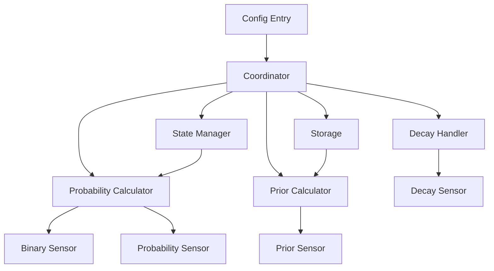
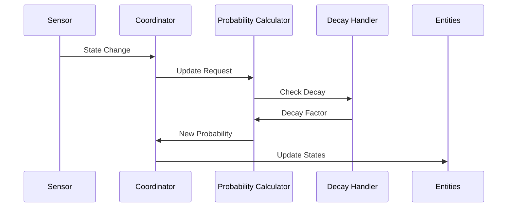
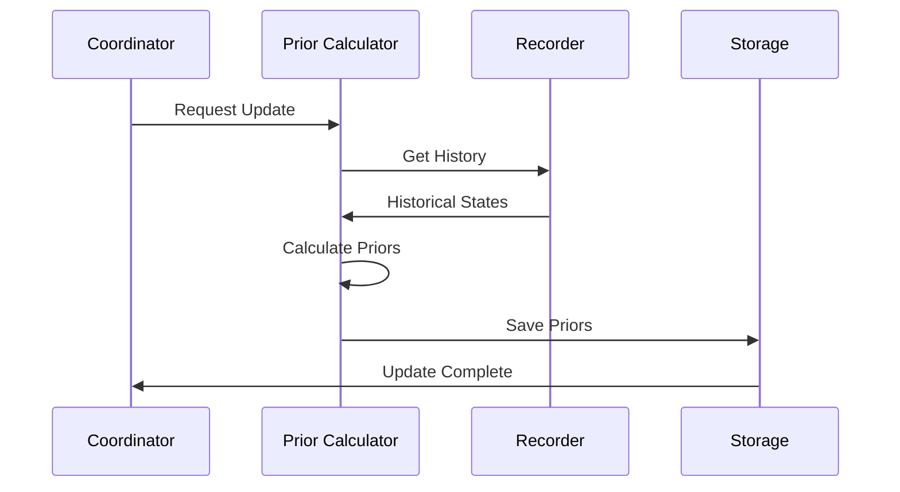

# Architecture

The Area Occupancy Detection integration uses a modular architecture with several key components working together to provide reliable occupancy detection.

## Overview



## Core Components

### Coordinator

The `AreaOccupancyCoordinator` is the central component that:

1. Manages data updates
2. Coordinates components
3. Handles state changes
4. Manages configuration

```python
class AreaOccupancyCoordinator(DataUpdateCoordinator):
    def __init__(self, hass: HomeAssistant, config_entry: ConfigEntry):
        self.config = dict(config_entry.data)
        self.inputs = SensorInputs.from_config(self.config)
        self.probabilities = Probabilities(config=self.config)
        self.decay_handler = DecayHandler(self.config)
        self.calculator = ProbabilityCalculator(...)
        self.storage = AreaOccupancyStorage(...)
```

### Probability Calculator

Handles Bayesian probability calculations:

```python
class ProbabilityCalculator:
    def calculate_occupancy_probability(
        self,
        active_sensor_states: dict[str, SensorState],
        now: datetime,
    ) -> ProbabilityState:
        # Calculate base probability
        calculated_probability = self._calculate_complementary_probability(...)

        # Calculate prior probability
        prior_probability = self._calculate_prior_probability(...)

        # Apply decay
        decayed_probability = self.decay_handler.calculate_decay(...)

        return ProbabilityState(...)
```

### Prior Calculator

Manages historical analysis and prior probabilities:

```python
class PriorCalculator:
    async def calculate_prior(
        self,
        entity_id: str,
        start_time: datetime,
        end_time: datetime
    ) -> tuple[float, float, float]:
        # Get historical states
        states = await self._get_states_from_recorder(...)

        # Calculate probabilities
        prob_given_true = self._calculate_conditional_probability(...)
        prob_given_false = self._calculate_conditional_probability(...)
        prior = self._calculate_prior(...)

        return (prob_given_true, prob_given_false, prior)
```

### Decay Handler

Manages probability decay over time:

```python
class DecayHandler:
    def calculate_decay(
        self,
        probability_state: ProbabilityState
    ) -> tuple[float, float]:
        if not self.decay_enabled:
            return probability_state.probability, 1.0

        elapsed = (now - probability_state.decay_start_time).total_seconds()
        decay_factor = self._calculate_decay_factor(elapsed)

        return self._apply_decay_factor(probability, decay_factor)
```

### State Manager

Handles sensor state tracking:

```python
class OccupancyStateManager:
    async def initialize_states(
        self,
        hass: HomeAssistant,
        sensor_ids: list[str]
    ) -> None:
        for entity_id in sensor_ids:
            state_obj = hass.states.get(entity_id)
            self._update_sensor_state(entity_id, state_obj)
```

### Storage Handler

Manages persistent storage:

```python
class AreaOccupancyStorage:
    async def async_save_prior_state(
        self,
        name: str,
        prior_state: PriorState
    ) -> None:
        data = self._data or self.store.create_empty_storage()
        data["prior_state"] = prior_state.to_dict()
        await self.async_save(data)
```

## Data Flow

### State Updates



### Prior Updates



## Key Classes

### ProbabilityState

Stores current probability state:

```python
@dataclass
class ProbabilityState:
    probability: float
    previous_probability: float
    threshold: float
    prior_probability: float
    sensor_probabilities: dict[str, dict[str, float]]
    decay_status: float
    current_states: dict[str, dict[str, str | bool]]
    previous_states: dict[str, dict[str, str | bool]]
    is_occupied: bool
    decaying: bool
    decay_start_time: datetime | None
```

### PriorState

Stores learned prior probabilities:

```python
@dataclass
class PriorState:
    overall_prior: float
    motion_prior: float
    media_prior: float
    appliance_prior: float
    door_prior: float
    window_prior: float
    light_prior: float
    environmental_prior: float
    entity_priors: dict[str, dict[str, float]]
    last_updated: dict[str, str]
    analysis_period: int
```

### SensorInputs

Manages sensor configuration:

```python
@dataclass
class SensorInputs:
    motion_sensors: list[str]
    primary_sensor: str
    media_devices: list[str]
    appliances: list[str]
    illuminance_sensors: list[str]
    humidity_sensors: list[str]
    temperature_sensors: list[str]
    door_sensors: list[str]
    window_sensors: list[str]
    lights: list[str]
```

## File Structure

```
area_occupancy/
├── __init__.py              # Integration setup
├── binary_sensor.py         # Binary sensor platform
├── calculate_prior.py       # Prior probability calculations
├── calculate_prob.py        # Probability calculations
├── const.py                 # Constants
├── config_flow.py          # Configuration UI
├── coordinator.py          # Data coordinator
├── decay_handler.py        # Decay management
├── exceptions.py           # Custom exceptions
├── helpers.py              # Utility functions
├── manifest.json           # Integration manifest
├── migrations.py           # Data migrations
├── number.py              # Threshold entity
├── probabilities.py       # Probability configs
├── sensor.py              # Sensor platform
├── service.py             # Service definitions
├── state_management.py    # State tracking
├── state_mapping.py       # State definitions
├── storage.py            # Data persistence
└── types.py              # Type definitions
```

## Development Flow

1. **Configuration**:
   - User configures integration
   - Config flow validates input
   - Creates config entry

2. **Initialization**:
   - Coordinator initializes
   - Components created
   - States loaded
   - Listeners setup

3. **Runtime**:
   - Sensors update states
   - Probability calculated
   - Decay applied
   - States updated
   - Data stored

4. **Historical Analysis**:
   - Periodic prior updates
   - History analyzed
   - Priors calculated
   - Results stored

## Extension Points

### New Sensor Types

1. Add constants:
```python
CONF_NEW_SENSOR = "new_sensors"
DEFAULT_WEIGHT_NEW = 0.3
```

2. Update configuration:
```python
SENSOR_CONFIG = {
    "prob_given_true": 0.2,
    "prob_given_false": 0.02,
    "default_prior": 0.2,
    "weight": DEFAULT_WEIGHT_NEW,
}
```

3. Add to SensorInputs:
```python
@dataclass
class SensorInputs:
    new_sensors: list[str]
```

### New Calculations

1. Create calculator:
```python
class NewCalculator:
    def calculate(self, data: dict) -> float:
        return result
```

2. Add to coordinator:
```python
class AreaOccupancyCoordinator:
    def __init__(self):
        self.new_calculator = NewCalculator()
```

3. Update probability calculation:
```python
def calculate_probability(self):
    new_factor = self.new_calculator.calculate(data)
    return combined_probability
```

## Testing

### Unit Tests

```python
def test_probability_calculation():
    calculator = ProbabilityCalculator(...)
    result = calculator.calculate_occupancy_probability(...)
    assert 0 <= result.probability <= 1
```

### Integration Tests

```python
async def test_coordinator_setup(hass):
    entry = await async_setup_component(hass, DOMAIN, config)
    coordinator = hass.data[DOMAIN][entry.entry_id]["coordinator"]
    assert coordinator.last_update_success
```

### End-to-End Tests

```python
async def test_occupancy_detection(hass):
    # Setup integration
    await async_setup_component(hass, DOMAIN, config)

    # Trigger sensor
    hass.states.async_set(
        "binary_sensor.motion",
        "on"
    )
    await hass.async_block_till_done()

    # Check result
    state = hass.states.get(
        "binary_sensor.area_occupancy_status"
    )
    assert state.state == "on"
```