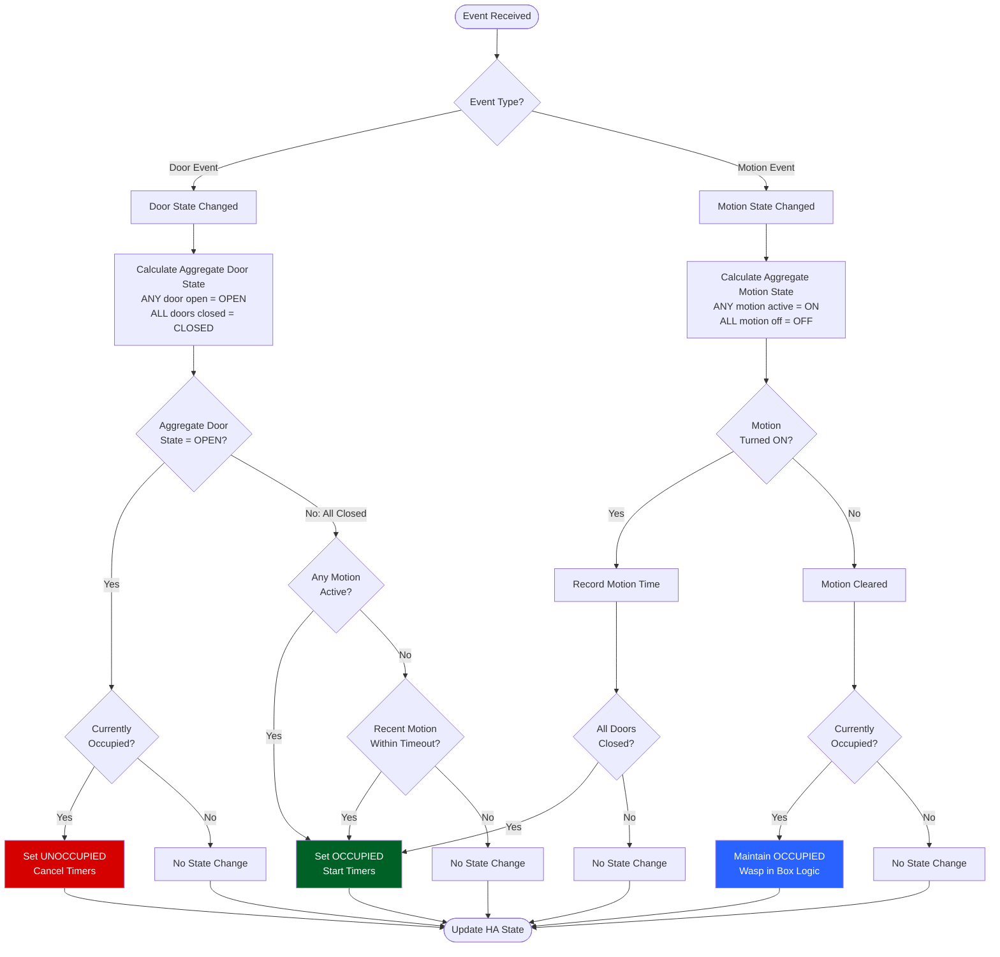

# Wasp in Box

The "Wasp in Box" feature provides enhanced occupancy detection for rooms with a single entry/exit point (like bathrooms, closets, or small offices). It uses a simple but effective principle: if someone enters a room and the door closes, they remain in that room until the door opens again.

## Concept

The feature is named after the concept of a wasp trapped in a box - once inside, it remains there until an opening appears. Similarly, once a person enters a closed space, they must be considered "present" until they exit through the door.

## Core Principles

The sensor implements three fundamental rules:

1. **ANY door opening releases occupancy** - The "wasp" can escape through any available exit
2. **ALL doors must be closed for occupancy** - The "box" must be sealed to trap the "wasp"
3. **ANY motion indicates presence** - Even a single motion sensor detecting movement confirms the "wasp" is present

## Logic Flow Chart

The following diagram shows how the sensor processes events and makes occupancy decisions:

**Key Decision Points:**

- **Door Opens**: If ANY door opens while occupied → immediate release
- **All Doors Close**: Check for active or recent motion to trigger occupancy
- **Motion Detected**: If all doors are closed → trigger occupancy
- **Motion Clears**: If occupied → maintain state (wasp in box principle)

## Complete Scenario Reference

This section documents every possible combination of door and motion events and the expected sensor behavior.

### Basic Entry Scenarios

#### Scenario 1: Door Closes → Motion Detected

**Initial State:** Sensor OFF, Door OPEN, Motion OFF

1. Door CLOSES → Sensor stays OFF (no motion yet)
2. Motion DETECTED → **Sensor turns ON** ✓

**Logic:** Motion detected with door closed triggers occupancy

---

#### Scenario 2: Motion Detected → Door Closes

**Initial State:** Sensor OFF, Door OPEN, Motion ON

1. Motion DETECTED (door open) → Sensor stays OFF (door still open)
2. Door CLOSES → **Sensor turns ON** ✓

**Logic:** Door closes with active motion triggers occupancy

---

#### Scenario 3: Motion → Clears → Door Closes (Within Timeout)

**Initial State:** Sensor OFF, Door OPEN, Motion OFF

1. Motion DETECTED → Sensor stays OFF (door still open)
2. Motion CLEARS → Sensor stays OFF
3. Wait < motion_timeout seconds
4. Door CLOSES → **Sensor turns ON** ✓

**Logic:** Door closes with recent motion (within timeout window) triggers occupancy. This is the classic "person enters room" pattern.

---

#### Scenario 4: Motion → Clears → Door Closes (After Timeout)

**Initial State:** Sensor OFF, Door OPEN, Motion OFF

1. Motion DETECTED → Sensor stays OFF (door still open)
2. Motion CLEARS → Sensor stays OFF
3. Wait > motion_timeout seconds
4. Door CLOSES → **Sensor stays OFF** ✗

**Logic:** Door closes but motion is too old (outside timeout window). This prevents false positives from stale motion events.

---

### Exit and Persistence Scenarios

#### Scenario 5: Door Opens While Occupied

**Initial State:** Sensor ON, Door CLOSED, Motion OFF

- Door OPENS → **Sensor turns OFF** ✓

**Logic:** Door opening always clears occupancy (the "wasp escapes" through any exit)

---

#### Scenario 6: Motion Clears While Occupied

**Initial State:** Sensor ON, Door CLOSED, Motion ON

- Motion CLEARS → **Sensor stays ON** ✓

**Logic:** Once occupied, sensor maintains state until door opens. This is the core "wasp in box" behavior - motion stopping doesn't mean the person left.

---

#### Scenario 7: Motion Detected With Door Already Closed

**Initial State:** Sensor OFF, Door CLOSED, Motion OFF

- Motion DETECTED → **Sensor turns ON** ✓

**Logic:** Motion with door closed immediately triggers occupancy

---

### Door Cycle Scenarios

#### Scenario 8: Multiple Door Cycles Without Motion

**Initial State:** Sensor OFF, Door CLOSED, Motion OFF

1. Door OPENS → Sensor stays OFF
2. Door CLOSES → Sensor stays OFF (no motion)
3. Door OPENS again → Sensor stays OFF
4. Door CLOSES again → **Sensor stays OFF** ✗

**Logic:** Door cycles without motion don't trigger occupancy. A person must be detected entering.

---

#### Scenario 9: Quick Entry Then Exit

**Initial State:** Sensor OFF, Door CLOSED, Motion OFF

1. Door OPENS → Sensor stays OFF
2. Motion DETECTED (briefly) → Sensor stays OFF (door open)
3. Motion CLEARS
4. Door CLOSES (within motion_timeout) → Sensor turns ON
5. Door OPENS immediately → **Sensor turns OFF** ✓

**Logic:** Detects person entering then immediately leaving. Motion during entry is captured, triggers occupancy when door closes, then door opening releases them.

---

### Verification Scenarios (if enabled)

#### Scenario 10a: Motion Sustained Through Verification

**Initial State:** Sensor OFF, verification_delay = 30s

1. Sensor turns ON (entry detected) → Verification timer starts
2. Wait 30 seconds
3. Motion still ON → **Sensor stays ON** ✓

**Logic:** Verification confirms genuine occupancy

---

#### Scenario 10b: Motion Clears Before Verification

**Initial State:** Sensor OFF, verification_delay = 30s

1. Sensor turns ON (entry detected) → Verification timer starts
2. Motion CLEARS
3. Wait 30 seconds
4. No motion detected → **Sensor turns OFF** ✓

**Logic:** Verification detected a false positive (e.g., sensor cooldown caused initial trigger). This prevents false occupancy from quick in-and-out movements.

---

### Timeout Scenarios

#### Scenario 11: Maximum Duration Timeout

**Initial State:** Sensor ON, max_duration = 3600s (1 hour)

- Wait > 3600 seconds → **Sensor turns OFF** ✓

**Logic:** Safety timeout prevents sensor staying ON indefinitely if someone exits through an unmonitored path

---

### Multiple Sensor Scenarios

#### Scenario 12: Multiple Doors - Any Door Opens

**Initial State:** Sensor ON, Door A CLOSED, Door B CLOSED

1. Door A OPENS → **Sensor turns OFF** ✓
2. (Door B still closed)

**Logic:** ANY door opening releases occupancy, regardless of which door or how many other doors remain closed

---

#### Scenario 13: Multiple Doors - All Must Close

**Initial State:** Sensor OFF, Door A OPEN, Door B CLOSED, Motion ON

1. Motion DETECTED → Sensor stays OFF (Door A still open)
2. Door B OPENS then CLOSES → Sensor stays OFF (Door A still open)
3. Door A CLOSES → **Sensor turns ON** ✓ (all doors now closed)

**Logic:** ALL doors must be closed for occupancy to trigger

---

#### Scenario 14: Multiple Motion Sensors - Any Triggers

**Initial State:** Sensor OFF, All Doors CLOSED, Motion1 OFF, Motion2 OFF

1. Motion2 DETECTED (Motion1 still OFF) → **Sensor turns ON** ✓

**Logic:** ANY motion sensor detecting movement triggers occupancy when doors are closed

---

#### Scenario 15: Multiple Motion Sensors - Staggered Detection

**Initial State:** Sensor OFF, All Doors CLOSED

1. Motion1 DETECTED → Sensor turns ON
2. Motion1 CLEARS
3. Motion2 DETECTED → **Sensor stays ON** ✓
4. Motion2 CLEARS → **Sensor stays ON** ✓ (wasp in box)
5. Door opens → Sensor turns OFF

**Logic:** ANY motion keeps occupancy active. Once all motion clears, wasp-in-box logic maintains occupancy until door opens.

---

## Decision Table

Quick reference for all state transitions:

| Current State | Door State   | Motion State | Motion Recency  | Result       | Reason                    |
| ------------- | ------------ | ------------ | --------------- | ------------ | ------------------------- |
| OFF           | Closes (all) | ON (any)     | -               | **Turn ON**  | Entry with active motion  |
| OFF           | Closes (all) | OFF          | Within timeout  | **Turn ON**  | Entry with recent motion  |
| OFF           | Closes (all) | OFF          | Outside timeout | Stay OFF     | Motion too old            |
| ON            | Opens (any)  | -            | -               | **Turn OFF** | Exit detected             |
| OFF           | Closed (all) | Turns ON     | -               | **Turn ON**  | Motion in closed room     |
| ON            | Closed (all) | Turns OFF    | -               | Stay ON      | Wasp in box persists      |
| OFF           | Open (any)   | ON           | -               | Stay OFF     | Can't trap with open door |
| OFF           | Open (any)   | OFF          | -               | Stay OFF     | No entry detected         |

## Benefits

- **Solves the "bathroom problem"**: Traditional motion sensors often time out while someone is in the bathroom, leading to lights turning off at inconvenient moments
- **Works with minimal sensors**: Can function with just a door sensor if needed
- **Complements motion detection**: Fills the gaps where motion detection fails
- **Improves automation reliability**: More accurately maintains occupancy state for rooms where people may be stationary
- **Supports multiple sensors**: Automatically aggregates state from multiple doors and motion sensors

## Technical Details

The Wasp in Box sensor tracks state transitions in a finite state machine:

1. **UNKNOWN** → Initial state before any data is collected
2. **UNOCCUPIED** → No one is in the room
3. **OCCUPIED** → Someone is in the room

The sensor uses Home Assistant's state tracking to monitor door and motion entities, processing their state changes to update its internal state based on the scenarios documented above.

### State Persistence

The sensor retains its state between Home Assistant restarts, making it reliable for long-term occupancy tracking. State restoration includes:

- Current occupancy status
- Last door event timestamp
- Last motion event timestamp
- Last occupied timestamp (for max duration calculations)

### Maximum Duration Feature

The sensor can be configured with a maximum occupancy duration. This addresses scenarios where a space might be incorrectly marked as occupied for extended periods:

1. When enabled, the sensor will automatically reset to unoccupied after the specified duration (see Scenario 11)
2. Set to 0 (default) to disable this feature and maintain the traditional Wasp in Box behavior
3. Useful in environments where someone might leave through an unmonitored exit

### Multi-Sensor Aggregation

When multiple sensors are configured, the Wasp in Box sensor automatically aggregates their states:

- **Multiple Doors**: Returns aggregate "OPEN" if ANY door is open, "CLOSED" if all are closed (Scenarios 12, 13)
- **Multiple Motion Sensors**: Returns aggregate "ON" if ANY sensor detects motion, "OFF" if all are off (Scenarios 14, 15)
- **Scalability**: Works seamlessly with any number of door or motion sensors
- **Reliability**: If one sensor fails or becomes unavailable, others continue to function

## Integration

The feature creates a binary sensor that becomes part of your Area Occupancy Detection system:

- **Entity ID**: `binary_sensor.[area_name]_wasp_in_box`
- **States**: `on` (occupied) / `off` (unoccupied)
- **Device Class**: `occupancy`
- **Weight**: The sensor's state is considered alongside other sensors in the Bayesian probability calculation, with its influence determined by the configured weight (default: 0.8)
- **Decay Disabled**: Unlike standard motion sensors, this sensor has probability decay disabled. When the door opens, it transitions immediately to "OFF", ensuring the room is marked as vacant instantly without a fading memory period.

## Configuration

The Wasp in Box sensor can be configured in the integration settings:

| Setting                       | Description                                                                                               | Default      | Related Scenarios  |
| ----------------------------- | --------------------------------------------------------------------------------------------------------- | ------------ | ------------------ |
| **Enable Wasp in Box**        | Turn this virtual sensor on or off                                                                        | Disabled     | All scenarios      |
| **Motion Timeout**            | How long motion events are considered recent (in seconds)                                                 | 300s (5 min) | Scenarios 3, 4     |
| **Wasp Weight**               | The weight factor for this sensor in probability calculations (0.1-1.0)                                   | 0.8          | N/A (probability)  |
| **Maximum Occupied Duration** | Maximum time (in seconds) a space can be marked as occupied before automatically resetting (0 = no limit) | 0 (disabled) | Scenario 11        |
| **Verification Delay**        | Delay before re-checking motion to verify occupancy, in seconds (0-120, 0 = disabled)                     | 0 (disabled) | Scenarios 10a, 10b |

### Motion Timeout

The motion timeout (default 300 seconds = 5 minutes) determines how long after motion detection the sensor will still consider that motion "recent" enough to trigger occupancy when a door closes.

- **Longer timeout**: More forgiving, catches slower-moving people (Scenario 3)
- **Shorter timeout**: More precise, reduces false positives from stale motion (Scenario 4)
- **Recommendation**: Start with 300s and adjust based on typical entry behavior

### Motion Re-verification

The verification delay feature helps prevent false positives when people enter and exit quickly:

- **How it works**: When the room is marked as occupied, wait the specified delay, then re-check motion sensors (Scenarios 10a, 10b)
- **If motion present**: Keep the room occupied (genuine occupancy)
- **If no motion**: Clear occupancy (false positive from sensor cooldown)
- **Recommendation**: Start with 15-30 seconds for most setups; adjust based on your motion sensor cooldown periods

## Use Cases & Examples

### Single Entry Point Rooms

Perfect for rooms with one door and predictable entry/exit patterns:

- **Bathrooms**: Maintain occupancy even when showering or otherwise stationary (Scenario 6)
- **Closets**: Detect occupancy in walk-in closets with minimal sensor requirements
- **Small Offices**: Maintain occupancy state when people are sitting still at a desk
- **Storage Rooms**: Track when people are retrieving items from storage

### Multiple Entry Point Rooms

Works with multiple doors when all exits are monitored:

- **Bathrooms with en-suite access**: Monitor both hallway and bedroom doors (Scenarios 12, 13)
- **Pass-through spaces**: Rooms with entrance and exit doors
- **Note**: ANY door opening releases occupancy, so all entry/exit points should have sensors

### Motion Detection Strategies

- **Comprehensive motion coverage**: Multiple motion sensors ensure detection anywhere in the room (Scenarios 14, 15)
- **Entry-only motion**: Single sensor at entrance captures people entering (Scenarios 1-4)
- **Door-only mode**: Can function without motion sensors using duration-based occupancy
- **Persistent occupancy**: Unlike regular motion sensors, maintains state during inactivity (Scenario 6)

## Entity Attributes

The sensor provides these diagnostic attributes to help understand its current state:

| Attribute              | Description                                                         | Example Value              |
| ---------------------- | ------------------------------------------------------------------- | -------------------------- |
| `door_state`           | Aggregate state of monitored door(s): "on" (open) or "off" (closed) | `off`                      |
| `last_door_time`       | ISO 8601 timestamp of the last door state change                    | `2025-01-15T10:30:45.123Z` |
| `motion_state`         | Aggregate state of motion sensors: "on" (detected) or "off" (clear) | `on`                       |
| `last_motion_time`     | ISO 8601 timestamp of the last motion detection                     | `2025-01-15T10:29:30.456Z` |
| `motion_timeout`       | Current motion timeout setting in seconds                           | `300`                      |
| `max_duration`         | Maximum occupancy duration in seconds (0 = disabled)                | `3600`                     |
| `last_occupied_time`   | ISO 8601 timestamp when the space was last marked as occupied       | `2025-01-15T10:30:00.789Z` |
| `verification_delay`   | Configured verification delay in seconds (0 = disabled)             | `30`                       |
| `verification_pending` | Whether a verification check is currently scheduled                 | `true` / `false`           |

These attributes are useful for:

- **Debugging**: Understanding why the sensor changed state
- **Automations**: Creating advanced logic based on timing or state combinations
- **Dashboards**: Displaying detailed occupancy information
