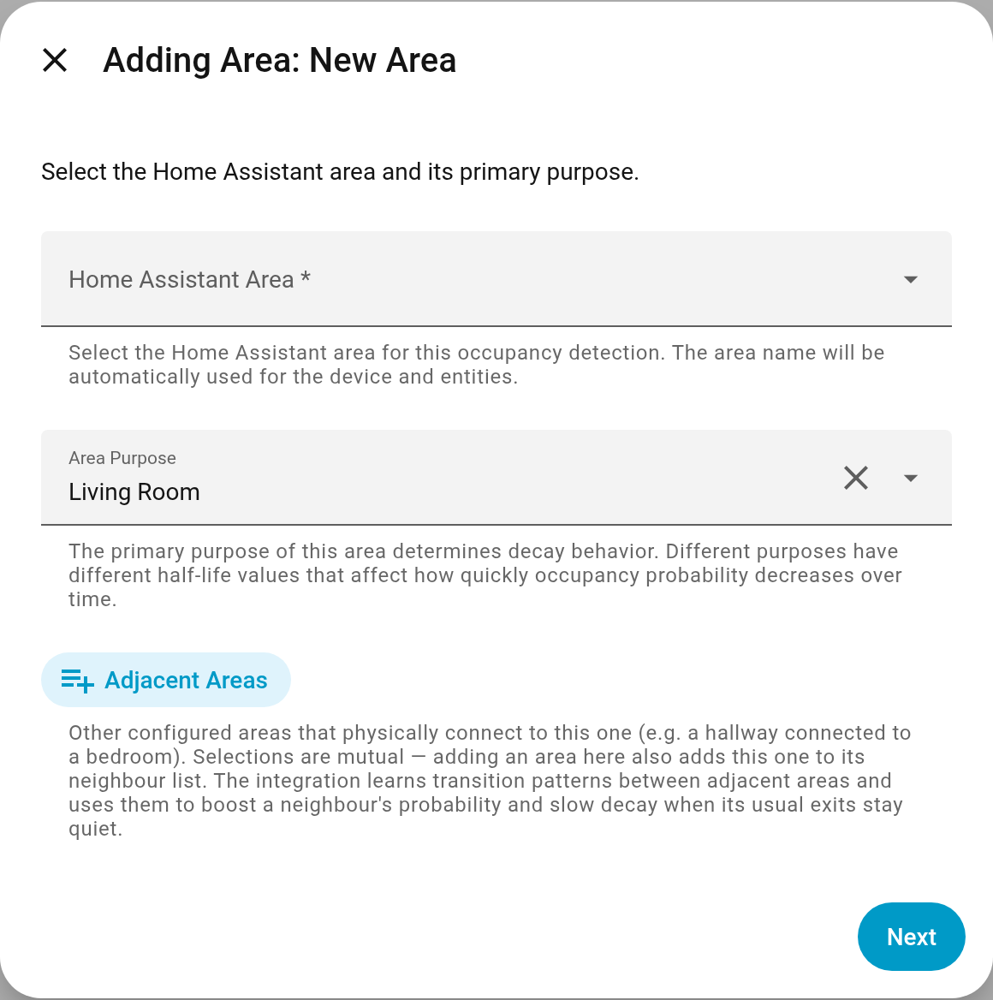
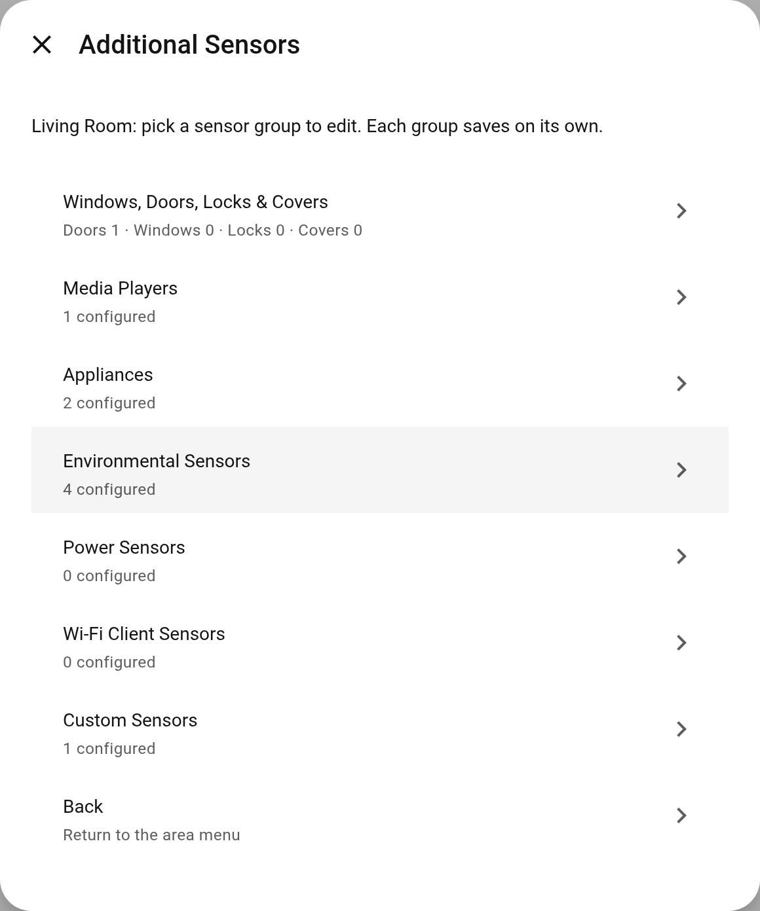
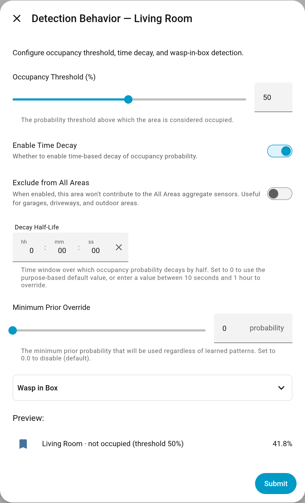
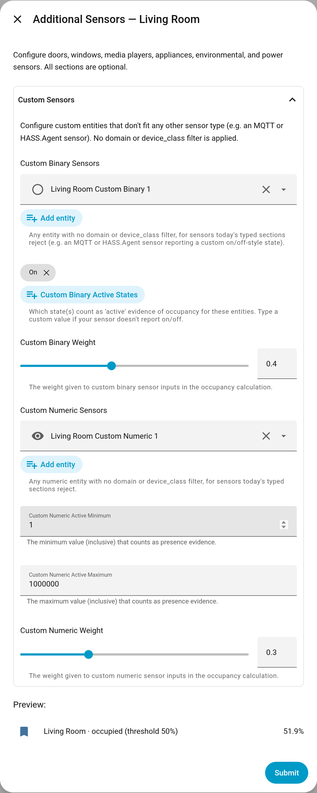
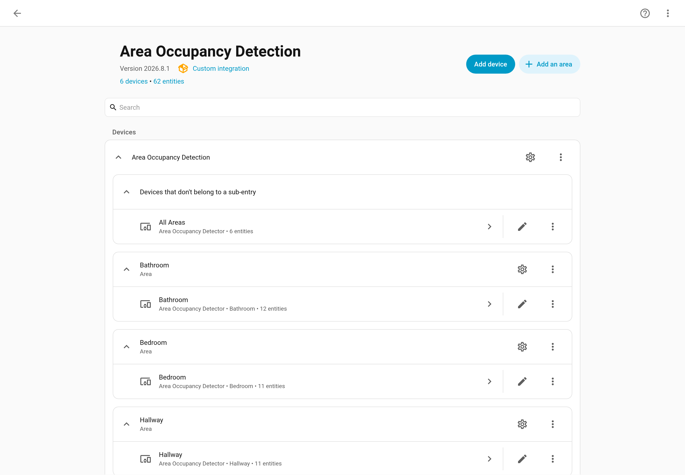
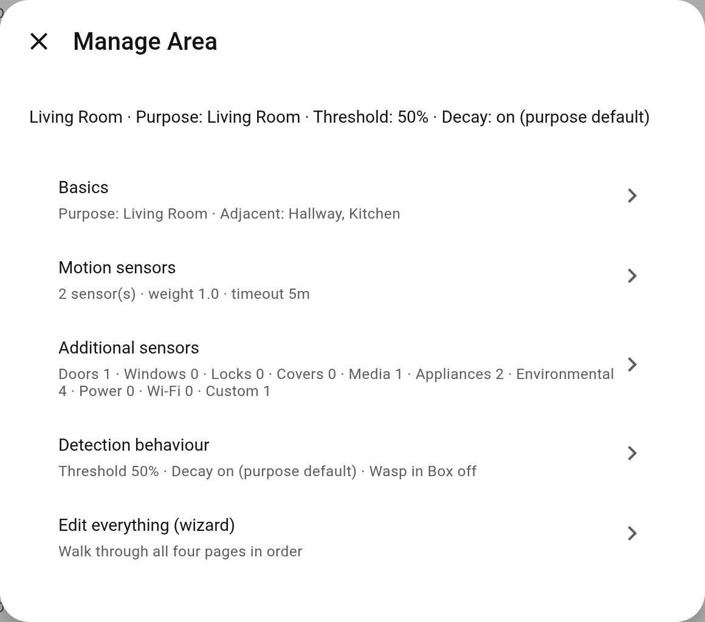
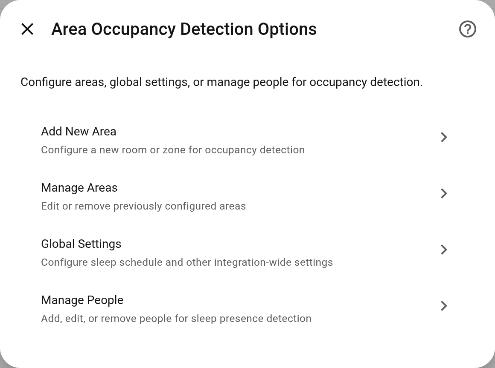

# Configuration

Area Occupancy Detection is built for simplicity: just specify the sensors available in each area and a purpose, the integration will then intelligently handle occupancy detection for you. While some customization options are available, the system’s powerful history-based intelligence learns your habits over time—automatically refining its accuracy without constant manual tweaking.

### Before You Start

Almost every option in the config is optional, sensible defaults are available for everything. The minimum configuration for an area is:

- A Home Assistant Area. Must exist in Home Assistant first, [see here to set up areas](https://www.home-assistant.io/docs/organizing/areas/)
- A Purpose. What the room is used for, [see more about purposes here](../features/purpose.md)
- 1 Motion sensor. A physical device in the area like PIR, mmWave

The integration will work with just these configured. Everything else can be added as you get new devices. However the more you add in, the more accurate the predictions will be.

## Configuration Wizard

Area configuration uses a multi-step wizard that walks you through setup one section at a time:

### Step 1: Area Basics

Select the Home Assistant area and its primary [Purpose](../features/purpose.md). The purpose sets a sensible default for the [decay](../features/decay.md) half-life used when probability decreases.

You can also select **Adjacent Areas** — other configured areas that physically connect to this one (a hallway and the bedroom it leads to, for example). The selection is symmetric: adding an area here also adds this one to its neighbour's list. Adjacency has no fixed strength setting; the integration learns how your household actually moves between the rooms and uses that to influence probability and decay. See [Adjacent Areas](../features/adjacent-areas.md) for details and what to expect during the learning period.

The following purposes are available (in order of decay time, shortest to longest):

- Passageway
- Driveway
- Utility
- Garage
- Kitchen
- Garden
- Bathroom
- Dining Room
- Living Room
- Office
- Media Room
- Bedroom

You can override the resulting half-life in the Detection Behavior step if needed.

**Global Sleep Schedule:**
For areas with the `Bedroom` purpose, the half-life dynamically adjusts based on your configured sleep schedule. You can set your household’s `Sleep Start` and `Sleep End` times in the **Global Settings** menu (accessible via the main integration options). Outside of sleep hours, `Bedroom` areas behave like `Living Room` areas.

**Sensor State Precision:**
To reduce database writes and storage consumption in the Home Assistant recorder, you can configure the global `Sensor state precision (decimals)` setting (0-2 decimals, default: 2) in the **Global Settings** menu. Lowering this value rounds the state of numeric diagnostic sensors (like probability, prior, decay, and confidence sensors), significantly reducing the volume of database updates.

### Step 2: Motion Sensors

Configure motion and presence sensors for the area. At least one motion sensor is required. You can also adjust:

- **Motion Weight**: How much influence motion sensors have on the calculation
- **Motion Timeout**: Additional timeout applied to historical motion data (configured using a duration picker)

### Step 3: Additional Sensors

Configure optional sensors grouped into collapsible sections. You only need to add [sensors](../features/sensors.md) that are relevant to the area:

- **Windows, Doors & Covers**: Door sensors, window sensors, cover entities with active state configuration
- **Media Players**: Media devices with active state selection
- **Appliances**: Switches and appliances with active state selection
- **Environmental Sensors**: Illuminance, temperature, humidity, CO2, CO, sound, pressure, air quality, VOC, PM2.5, PM10
- **Power Sensors**: Power consumption monitoring

More information on the [Sensors](../features/sensors.md) page.

### Step 4: Detection Behavior

Configure how occupancy is detected and reported:

| Parameter                   | Description                                                                                                                                 | Default          |
| --------------------------- | ------------------------------------------------------------------------------------------------------------------------------------------- | ---------------- |
| Occupancy Threshold (%)     | The probability percentage required for the main **Occupancy Status** binary sensor to turn `on`                                            | 50%              |
| Enable Time Decay           | Toggle whether to enable the [Probability Decay](../features/decay.md) feature                                                              | Enabled          |
| Decay Half-Life             | How long it takes for probability to reduce by half after activity stops (duration picker)                                                  | Based on purpose |
| Minimum Prior Override      | The minimum prior probability to use, overriding learned patterns. Set to 0 to disable.                                                    | 0 (disabled)     |
| Exclude from All Areas      | When enabled, this area won’t contribute to the [All Areas](../features/entities.md#all-areas-aggregation-device) or floor aggregate sensors. Useful for garages, driveways, and outdoor areas. | Disabled |

This step also includes the [Wasp in Box](../features/wasp-in-box.md) configuration section for single-entry rooms.

## Custom Sensors

The typed sensor sections carry built-in meaning: a door counts as occupied when it is *closed*, a media player when it is playing or paused, and so on. They also filter the entity picker by domain and device class, so an entity without the expected device class never appears. When an entity does not fit any of them, add it under **Custom Sensors** instead of forcing it into a section that would apply the wrong semantics.

The section has two halves, because the integration treats binary and numeric evidence differently:

**Custom binary sensors** — any `binary_sensor` or `sensor` entity, with no domain or device-class filter at all. Alongside it:

- **Custom binary active states** – the states that count as evidence of occupancy. Defaults to `on`; type a state your installation uses, such as `in_use` or `gaming`, if your sensor reports something else.
- **Custom binary weight** – how much these entities influence the result, from 0 to 1.

**Custom numeric sensors** — any `sensor` entity, again unfiltered. Alongside it:

- **Custom numeric active minimum / maximum** – the inclusive band of readings that counts as evidence of occupancy. The default band is 1 to 1,000,000 inclusive: a reading below 1 or above 1,000,000 is not evidence. The upper bound is a stand-in for "no practical ceiling" rather than a considered limit, so tune both ends to your sensor. The minimum must be below the maximum, or the form rejects it — an inverted band would match nothing.
- **Custom numeric weight** – as above.

Use these for a sensor from a custom integration or MQTT, an entity whose active state is the opposite of its type default, a HASS.Agent sensor reporting a bespoke state, or a domain the sections above do not cover. As with the typed sections, the active states and the band apply to every entity in that half, so put entities that behave differently in different areas — or use the typed section that already matches them.

Custom sensors take part in the hourly correlation analysis like every other non-motion sensor, so their likelihoods are refined from your own history over time.

## Where Areas Live

Each area is a **config subentry** of the single Area Occupancy Detection entry. On the integration page every area appears as its own group with its device and entities beneath it, plus:

- **Add an area** at the top of the page, which opens the same four-step wizard
- a **gear icon** on each area, which opens that area's edit menu
- **Delete** in each area's overflow menu, which removes the area and its entities

Upgrading from an earlier version moves your existing areas into subentries automatically. Names, entities, devices and all learned history are preserved; nothing needs to be reconfigured.

The **Configure** dialog still exists for settings that are not per-area: global settings, people, and resetting an area's learned history.

## Editing an Existing Area

Click the gear icon on the area you want to change (or open **Configure** and choose **Manage Areas**). The area menu lists each part of the configuration with a one-line summary of its current values:

- **Basics** – purpose and adjacent areas
- **Motion sensors** – sensors, weight, timeout and likelihoods
- **Additional sensors** – opens a second menu with one entry per sensor group (doors/windows/locks/covers, media, appliances, environmental, power, Wi-Fi clients, custom)
- **Detection behaviour** – threshold, decay, minimum prior and Wasp in Box

Each entry opens just that page and saves when you press **Submit**, so changing one value no longer means stepping through the whole wizard. The motion, additional-sensor and behaviour pages show a **live preview** beside the form: the probability the area would read right now with the values you are editing, whether that crosses the threshold, and which sensors are currently contributing. It is a sensor-only estimate from current states and learned priors; activity and adjacency boosts, Wasp in Box and decay timing are not simulated, and the current live probability is listed for comparison. **Edit everything (wizard)** is still there if you want to walk all four pages in order.

## People Management

You can configure sleep presence detection through the **Manage People** option in the integration’s main menu. This allows the integration to detect when people are sleeping and maintain high occupancy probability in bedrooms overnight.

For each person, you configure:

- **Person Entity**: The `person.<name>` entity to track
- **Sleep Sensors**: One or more sleep detection sensors (supports both numeric sensors like Companion App sleep confidence and binary sensors like in-bed sensors or iOS Sleep Focus)
- **Sleep Area**: Which area this person sleeps in
- **Confidence Threshold**: Minimum value for numeric sleep sensors to consider the person sleeping (default: 75). Does not apply to binary sensors.
- **Device Tracker** *(optional)*: A specific device tracker for home/away detection instead of the person entity

When configured, a **Sleeping** binary sensor is created for each assigned area. See [Sleep Presence](../features/sleep-presence.md) for details.

## Next Steps

After configuration:

1. Monitor the created entities to ensure they reflect actual occupancy
2. Adjust the threshold if needed
3. Review the [Basic Usage](basic-usage.md) guide
