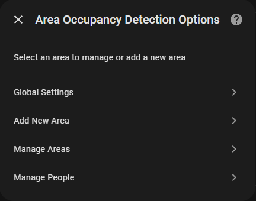
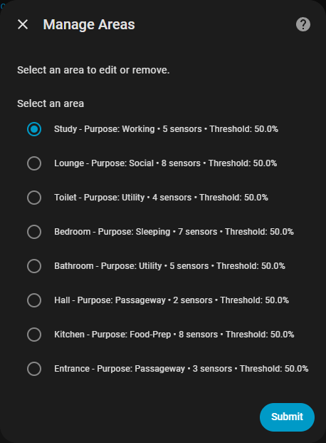
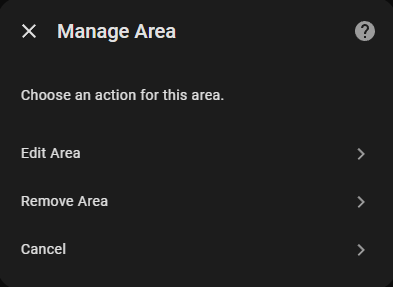

# Installation

## HACS

1. **Ensure HACS is installed:** If you don't have the [Home Assistant Community Store (HACS)](https://hacs.xyz/) installed, follow their instructions to set it up first.
2. **Navigate to HACS:** Open your Home Assistant frontend and go to HACS in the sidebar.
3. **Search for Area Occupancy Detection:** Search for "Area Occupancy Detection" and select then **Download**.
4. **Restart Home Assistant:** After the download is complete, restart your Home Assistant instance

## Initial Setup

1. Go to **Settings** > **Devices & Services** > **Integrations** > **+ Add Integration**.
2. Search for **Area Occupancy Detection** and select it.
3. **Configure Area Name:**
   - Select a Home Assistant area for this occupancy detection. The area name will be automatically used for the device and entities.
   - You may need to create the area in Home Assistant first if it doesn't exist.
4. **Configure Area Purpose:**
   - Choose the purpose of the area. This sets a sensible default for the decay half-life used when probability decreases. The purpose selection affects how quickly the system "forgets" about occupancy after activity stops.
5. **Configure Sensors:**
   - Select the sensors that will be used to detect occupancy.
   - You will need to select at least one motion/presence sensor for the integration to work.
   - You can then add sensors of many different types to the area to improve the accuracy of the occupancy detection.

## Configuration

When you first create the integration you will be taken straight to configuring the first area.

When adding new areas you will need to navigate to **Integrations** -> **Area Occupancy Detection** -> **Configure (⚙️ Cog icon)**. This will bring up the configuration menu.

There is detailed documentation on the configuration options here: [Configuration](configuration.md).

### Before You Start

Almost every option in the config is optional, sensible defaults are available for eveything. The minimum configuration for an area is:

- A Home Assistant Area. Must exist in Home Assistant first, [see here to set up areas](https://www.home-assistant.io/docs/organizing/areas/)
- A Purpose. What the room is used for, [see more about purposes here](../features/purpose.md)
- 1 Motion sensor. A physical device in the area like PIR, mmWave

The integration will work with just these configured. Everything else can be added as you get new devices. However the more you add in, the more accurate the predictions will be.

### Main Menu

The main menu allows you to modify global settings, add a new area, manage existing areas, or manage people for sleep presence detection.

### Global Settings

The global settings menu allows you to modify the global settings for the integration, these are limited for now and will be expanded in the future.

### Add New Area

The add new area menu allows you to add a new area to the integration.

### Manage Areas

The manage areas menu allows you to manage existing areas, you can see a summary of each area and the sensors associated with it. You can then select one of the areas to edit or remove.

### Manage People

The manage people menu allows you to add and configure people associated with your home, they must be set up as people in Home Assistant first so they can be selected in the people picker. Choosing entities for sleep confidence and device tracking (from HA Companion app for example) allows AOD to track sleep for a given area. Choosing an area for a person essentially defines their bedroom.

## Getting Help

If you encounter issues:

1. Search [GitHub Issues](https://github.com/Hankanman/Area-Occupancy-Detection/issues)
2. Join the [Discussion](https://github.com/Hankanman/Area-Occupancy-Detection/discussions)
