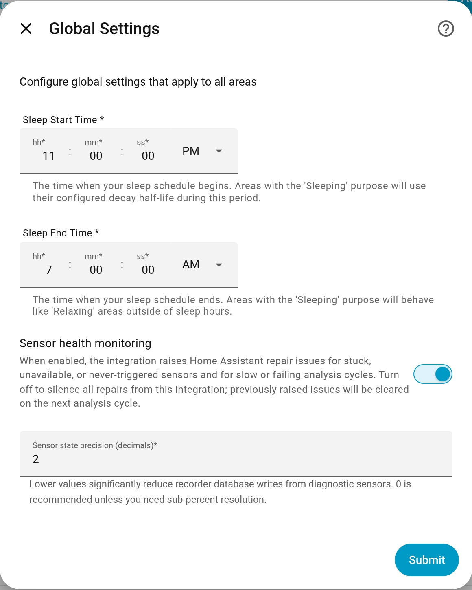
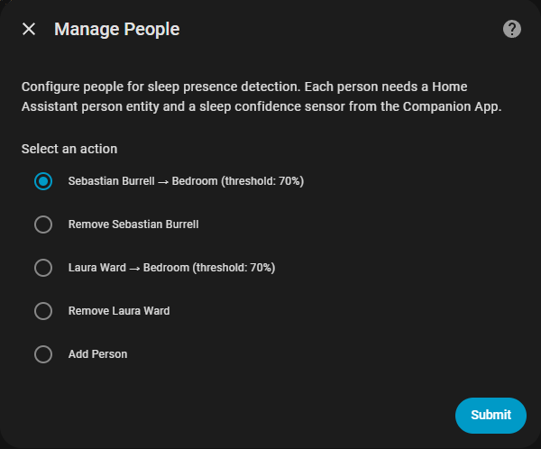
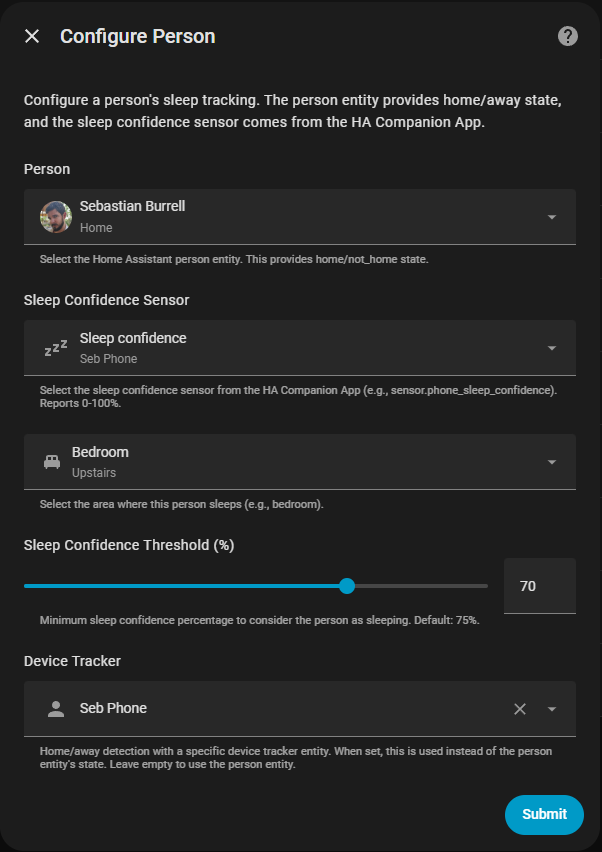

# Installation

## HACS

1. **Ensure HACS is installed:** If you don't have the [Home Assistant Community Store (HACS)](https://hacs.xyz/) installed, follow their instructions to set it up first.
2. **Navigate to HACS:** Open your Home Assistant frontend and go to HACS in the sidebar.
3. **Search for Area Occupancy Detection:** Search for "Area Occupancy Detection" and select then **Download**.
4. **Restart Home Assistant:** After the download is complete, restart your Home Assistant instance

## Initial Setup

1. Go to **Settings** > **Devices & Services** > **Integrations** > **+ Add Integration**.
2. Search for **Area Occupancy Detection** and select it.
3. **Configure Area Name:**
   - Select a Home Assistant area for this occupancy detection. The area name will be automatically used for the device and entities.
   - You may need to create the area in Home Assistant first if it doesn't exist.
4. **Configure Area Purpose:**
   - Choose the purpose of the area. This sets a sensible default for the decay half-life used when probability decreases. The purpose selection affects how quickly the system "forgets" about occupancy after activity stops.
5. **Configure Sensors:**
   - Select the sensors that will be used to detect occupancy.
   - You will need to select at least one motion/presence sensor for the integration to work.
   - You can then add sensors of many different types to the area to improve the accuracy of the occupancy detection.

## Configuration

When you first create the integration you will be taken straight to configuring the first area.

Each area is a **config subentry**, so after that first area everything lives on the
integration's own page: **Settings** → **Devices & Services** → **Area Occupancy Detection**.
Every area appears there as its own group with its device and entities beneath it.

There is detailed documentation on the configuration options here: [Configuration](configuration.md).

### Before You Start

For an ideal setup you will need to perform these steps in Home Assistant before setting up the integration:

- Set up Home Assistant Areas, [see here to set up areas](https://www.home-assistant.io/docs/organizing/areas/)
- Set up Home Assistant Floors, [see here to set up floors](https://www.home-assistant.io/docs/organizing/floors/)
- Set up Home Assistant People, [see here to set up people](https://www.home-assistant.io/integrations/person/)

Almost every option in the config is optional, sensible defaults are available for eveything. The minimum configuration for an area is:

- A Home Assistant Area. Must exist in Home Assistant first, [see here to set up areas](https://www.home-assistant.io/docs/organizing/areas/)
- A Purpose. What the room is used for, [see more about purposes here](../features/purpose.md)
- 1 Motion sensor. A physical device in the area like PIR, mmWave

The integration will work with just these configured. Everything else can be added as you get new devices. However the more you add in, the more accurate the predictions will be.

### Adding an Area

Press **Add an area** at the top of the integration page. The first step asks for the Home
Assistant area and its [purpose](../features/purpose.md); the purpose sets a sensible default
for how quickly probability decays once activity stops.

The next steps ask for the motion sensors in that area, then any other sensors you have. On
first setup just add the sensors you own and leave the weights and states at their defaults —
everything after the motion step is optional.

### Editing an Area

Press the **gear icon** on an area to open its menu. Each entry summarises what it currently
holds, so you can see the whole area at a glance and open only the page you want to change.

The sensor, motion and behaviour pages show a **live preview**: the probability the area would
read right now with the values you are editing, and whether that crosses the threshold.

Additional sensors are grouped, one page per kind, so you are never scrolling past sections
that do not apply to the room.

### Global Settings and People

The **Configure** button holds the settings that are not per-area — the household sleep
schedule, sensor health reporting, state precision, and people.

### Manage People

The **Manage People** option lets you add and configure people associated with your home. They must be set up as people in Home Assistant first so they can be selected in the people picker. Choosing entities for sleep confidence and device tracking (from HA Companion app for example) allows AOD to track sleep for a given area. Choosing an area for a person essentially defines their bedroom.

## Getting Help

If you encounter issues:

1. Search [GitHub Issues](https://github.com/Hankanman/Area-Occupancy-Detection/issues)
2. Join the [Discussion](https://github.com/Hankanman/Area-Occupancy-Detection/discussions)
