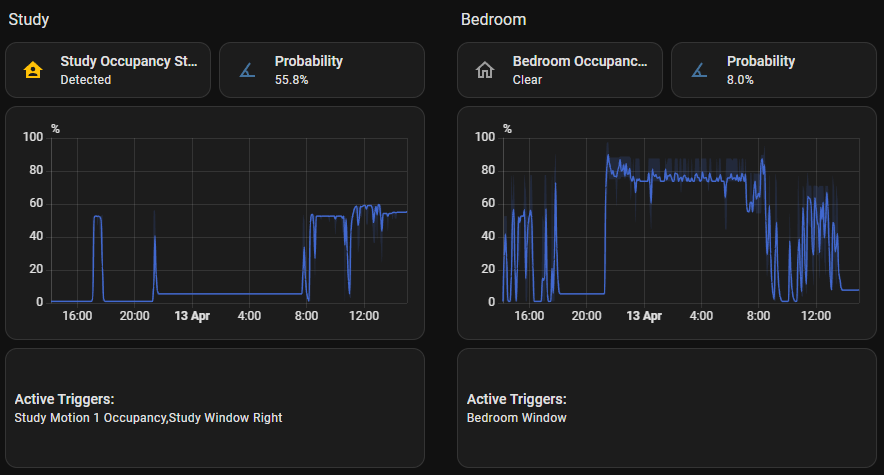

# Home Assistant - Area Occupancy Detection

**Intelligent room occupancy detection using Bayesian probability.**

This integration provides enhanced room occupancy detection for Home Assistant by intelligently combining data from multiple sensor inputs. Unlike simple motion sensors, it leverages Bayesian probability calculations to factor in various environmental cues and device states, leading to more accurate and resilient occupancy detection.

## Challenges with Basic Motion Sensors

*   **Lights turning off while you're still:** If you sit still for too long, a basic motion sensor assumes the room is empty.
*   **False triggers:** A pet walking through might trigger occupancy.
*   **Limited context:** Simple motion doesn't know if you're watching TV, working at a desk, or just passing through.

## How Area Occupancy Detection Helps

*   **Increased Accuracy:** By fusing data from multiple sensor types (motion, doors, lights, media, etc.), the system gains a much richer understanding of the area's status.
*   **Probabilistic Approach:** Instead of a simple ON/OFF state, it calculates an *occupancy probability*. You decide how certain the system must be before declaring occupancy.
*   **Adaptability:** The prior probability learning feature analyses how *your* sensors correlate with actual occupancy, learning which sensors are reliable indicators.
*   **Reduced False Negatives/Positives:** The combination of multi-sensor input, learned probabilities and decay logic significantly reduces incorrect occupancy states.

## Key Features

*   **Multi-Sensor Fusion:** Combines inputs from motion/occupancy sensors, media players, lights, doors, windows, appliances and environmental sensors (temperature, humidity, illuminance).
*   **Bayesian Inference:** Calculates the probability of occupancy based on the current state of configured sensors and their individual learned likelihoods.
*   **Prior Probability Learning:** Automatically learns how sensor states relate to actual occupancy (using a primary sensor as ground truth) over a configurable history period.
*   **Configurable Weights:** Assign weights to different sensor *types* to influence their impact on the overall probability.
*   **Probability Decay:** Gradually decreases the occupancy probability when sensors indicate inactivity, providing a natural transition to "unoccupied".
*   **Purpose-Based Decay:** Choosing a room purpose automatically sets a decay half life suited to the space.
*   **Configurable Threshold:** Define the probability percentage required to consider the area "occupied".
*   **Exposed Entities:**
    *   Occupancy Probability Sensor (%)
    *   Occupancy Status Binary Sensor (on/off)
    *   Prior Probability Sensor (%)
    *   Decay Status Sensor (%)
    *   Occupancy Threshold Number Input
*   **UI Configuration:** Easy setup and management through the Home Assistant UI.
*   **Manual Prior Update Service:** Trigger the prior learning process on demand.

## Screenshots

## How It Works

1.  **Configuration:** You select various sensors associated with an area (motion, doors, lights, media players, etc.) and configure parameters like weights and the history period for learning.
2.  **Prior Learning:** The integration analyses the history of your selected sensors against a designated primary motion/occupancy sensor. It calculates:
    *   **P(Sensor Active | Area Occupied):** How likely is a sensor to be active when the area is truly occupied?
    *   **P(Sensor Active | Area Not Occupied):** How likely is a sensor to be active when the area is *not* occupied?
    *   **P(Area Occupied):** The baseline (prior) probability of the area being occupied, derived from the primary sensor's history.
    These learned probabilities (or defaults if history is insufficient) are stored and used in calculations.
3.  **Real-time Calculation:** As your sensor states change, the integration uses Bayes' theorem. For each *active* sensor, it updates the probability of occupancy based on its learned likelihoods and the overall prior probability.
4.  **Weighted Combination:** The contributions from individual active sensors are combined using a complementary probability approach, factoring in their configured weights.
5.  **Output:** The final calculated probability is exposed. If it crosses the configured threshold, the Occupancy Status sensor turns "on".
6.  **Decay:** If the probability starts decreasing (fewer active sensors), an exponential decay function gradually lowers the probability over a configured time window, unless new sensor activity pushes it back up.

## Getting Started

See the [Installation](getting-started/installation.md) and [Configuration](getting-started/configuration.md) guides.
