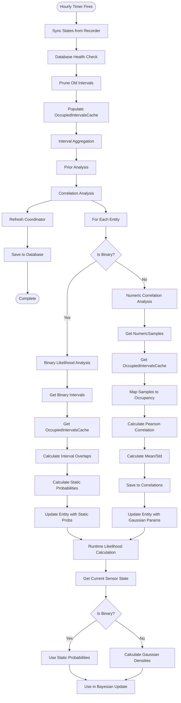

# Sensor Correlation Analysis Chain

This document provides a comprehensive breakdown of the sensor analysis chain, from data collection through likelihood calculation. It details how numeric sensors use correlation analysis with Gaussian PDFs, while binary sensors use duration-based static probability calculation.

## Table of Contents

1. [Complete Flow Overview](#complete-flow-overview)
2. [Phase-by-Phase Breakdown](#phase-by-phase-breakdown)
3. [Key Operations Reference](#key-operations-reference)
4. [Unified Architecture](#unified-architecture)

## Complete Flow Overview

The analysis chain consists of four main phases:

1. **Data Collection** (Continuous) - Raw sensor data is continuously synced from Home Assistant
2. **Hourly Analysis Cycle** (Scheduled) - Periodic analysis runs every hour
3. **Sensor Analysis** (Within Analysis Cycle) - Analyses sensors using appropriate method:
   - **Numeric Sensors**: Correlation analysis with Gaussian PDFs
   - **Binary Sensors**: Duration-based static probability calculation
4. **Likelihood Calculation** (Runtime) - Retrieves likelihoods using appropriate method based on sensor type

## Phase-by-Phase Breakdown

### Phase 1: Data Collection (Continuous)

#### Step 1.1: Sync States from Recorder

**What Happens**:

- Fetches recent state changes from Home Assistant recorder
- Converts numeric sensor states to `NumericSamples` records
- Converts binary sensor states to `Intervals` records
- Stores in database tables

**Data Stored**:

- `NumericSamples` table: Raw numeric sensor values with timestamps
- `Intervals` table: Binary sensor state intervals (on/off periods)

---

### Phase 2: Hourly Analysis Cycle (Scheduled)

**Trigger**: Scheduled timer fires every hour

**Note**: The analysis cycle orchestrates the complete analysis chain for all configured areas.

#### Step 2.1: Sync States

Imports latest data from Home Assistant recorder into local database.

#### Step 2.2: Database Health Check & Pruning

Ensures database integrity and removes old data beyond retention period.

#### Step 2.3: Populate OccupiedIntervalsCache

Calculates occupied intervals from motion sensors (ground truth) and caches them for efficient access during analysis.

#### Step 2.4: Interval Aggregation

Aggregates raw intervals into daily/weekly/monthly aggregates for trend analysis and long-term storage.

#### Step 2.5: Prior Analysis

Calculates global prior probability and time-based priors for each area from historical occupancy data.

#### Step 2.6: Correlation Analysis

Runs correlation analysis for all configured sensors (excluding motion sensors) to learn how each sensor correlates with occupancy.

#### Step 2.7: Refresh & Save

Updates coordinator state and persists all changes to database.

---

### Phase 3: Correlation Analysis (Step 6 Detail)

#### Step 3.1: Get Correlatable Entities

**What Happens**:

- Returns all configured sensors for the area (excluding motion sensors).
- Identifies if each entity is binary or numeric.

#### Step 3.2: Analyze Each Entity

For each entity:

1. **Route by Type**:

   - **Binary Sensors**: Performs duration-based analysis to calculate static probabilities.
   - **Numeric Sensors**: Performs correlation analysis to learn Gaussian parameters.

2. **Update Live Entity**:

   - **Binary Sensors**: Updates entity with learned `prob_given_true` and `prob_given_false` values.
   - **Numeric Sensors**: Updates entity with learned Gaussian parameters (mean, standard deviation) for occupied and unoccupied states.

3. **Persist Results**:
   - **Binary Sensors**: Saves binary likelihood results (including `analysis_error` if present) to the database.
   - **Numeric Sensors**: Saves correlation results (including `analysis_error` if present) to the database.

#### Step 3.3a: Binary Sensor Analysis

**Process**:

1. **Get Occupied Intervals**:

   - Retrieves occupied intervals from `OccupiedIntervalsCache` for the analysis period.

2. **Get Binary Sensor Intervals**:

   - Queries `Intervals` table for the binary sensor's state changes.

3. **Calculate Overlaps**:

   - For each binary sensor interval, calculates overlap duration with occupied periods.
   - Calculates overlap duration with unoccupied periods.

4. **Calculate Probabilities**:

   - `prob_given_true = active_duration_occupied / total_occupied_duration`
   - `prob_given_false = active_duration_unoccupied / total_unoccupied_duration`

5. **Clamp and Return**:

   - Clamps probabilities between 0.05 and 0.95.
   - Returns static probability values.

6. **Save to Database**:
   - Results (including `analysis_error` if analysis failed) are persisted to the `Correlations` table with `correlation_type="binary_likelihood"`.
   - This ensures that `analysis_error` values are preserved across entity reloads.

#### Step 3.3b: Numeric Sensor Analysis

**Process**:

1. **Data Retrieval**:

   - Queries `NumericSamples` directly for the analysis period.

2. **Map to Occupancy**:

   - Checks each sample timestamp against `OccupiedIntervalsCache`.
   - Creates parallel arrays of values and occupancy flags (0/1).

3. **Calculate Pearson Correlation**:

   - Determines relationship between value and occupancy.

4. **Calculate Statistics**:

   - Learns Mean/Std for Occupied state.
   - Learns Mean/Std for Unoccupied state.

5. **Save Result**:
   - Persists parameters to `Correlations` table, including `analysis_error` if analysis failed.
   - This ensures that `analysis_error` values are preserved across entity reloads.

---

### Phase 4: Likelihood Calculation (Runtime)

This phase occurs at runtime whenever the Bayesian probability calculation needs likelihood values.

#### Step 4.1: Get Likelihoods

**What Happens**:

1. **Check Sensor Type**:

   - **Binary Sensors** (media, appliances, doors, windows):

     - If analysis has been run: Returns stored `prob_given_true` and `prob_given_false`.
     - If not analyzed: Returns `EntityType` default probabilities.

   - **Numeric Sensors**:
     - Gets current sensor state value.
     - If state is unavailable: Uses representative value (average of occupied/unoccupied means).
     - Calculates Gaussian densities using learned parameters.

2. **Calculate Probabilities**:

   - **Binary Sensors**: Returns static probabilities directly.
   - **Numeric Sensors**: Calculates $P(value | Occupied)$ and $P(value | Unoccupied)$ using Gaussian PDF.

3. **Return Probabilities**:
   - Returns the two probabilities for Bayesian update.

## Key Operations Reference

This section provides a quick reference to the key operations in the analysis chain.

### Data Collection Operations

- **State Synchronization**: Syncs state changes from Home Assistant recorder to local database

### Analysis Operations

- **Full Analysis Orchestration**: Orchestrates the complete analysis chain for all areas
- **Occupied Intervals Cache Population**: Populates occupied intervals cache from motion sensors
- **Interval Aggregation**: Aggregates raw intervals into daily/weekly/monthly summaries
- **Correlation Analysis**: Main correlation analysis entry point for all sensors
- **Entity Identification**: Identifies entities eligible for correlation analysis
- **Binary Likelihood Calculation**: Calculates duration-based probabilities for binary sensors
- **Numeric Correlation Calculation**: Calculates Pearson correlation and Gaussian parameters for numeric sensors

### Runtime Operations

- **Likelihood Retrieval**: Retrieves likelihood values for Bayesian calculation at runtime based on current sensor state

## Unified Architecture

The analysis chain follows a unified architecture that separates concerns by sensor type while maintaining a consistent data flow:

### Data Flow Architecture

1. **Continuous Data Collection**: Raw sensor data flows from Home Assistant recorder into local database tables
2. **Scheduled Analysis**: Hourly analysis cycle processes collected data through multiple stages
3. **Type-Specific Analysis**: Sensors are routed to appropriate analysis methods based on their type
4. **Runtime Calculation**: Learned parameters are used for real-time likelihood calculation

### Analysis Method Architecture

The system uses a **dual-path architecture** for sensor analysis:

- **Binary Path**: Duration-based static probability calculation
  - Suitable for: motion, media, appliances, doors, windows
  - Output: Static `prob_given_true` and `prob_given_false` values
  - Storage: `Correlations` table with `correlation_type="binary_likelihood"`

- **Numeric Path**: Correlation analysis with Gaussian PDFs
  - Suitable for: temperature, humidity, illuminance, CO2, sound pressure, etc.
  - Output: Gaussian parameters (mean, std_dev) for occupied/unoccupied states
  - Storage: `Correlations` table with correlation coefficients and statistics

### Component Architecture

The architecture consists of four main layers:

1. **Database Layer**: Handles data storage, syncing, and correlation analysis
2. **Analysis Layer**: Orchestrates analysis cycles and prior calculations
3. **Entity Layer**: Manages entity state and runtime likelihood calculation
4. **Coordinator Layer**: Coordinates all components and schedules analysis

### Architecture Overview

The system uses different analysis methods optimized for each sensor type:

### Key Design Decisions

1. **Numeric Sensors**: Use correlation analysis with Gaussian PDFs for dynamic, continuous likelihood calculation.
2. **Binary Sensors**: Use duration-based analysis for simple, reliable static probabilities.
3. **Motion Sensors**: Use configured static probabilities (not analyzed).

### Benefits

- **Appropriate Methods**: Each sensor type uses the analysis method best suited to its data characteristics.
- **Dynamic Likelihoods (Numeric)**: Continuous values benefit from Gaussian PDF calculation.
- **Simple Reliability (Binary)**: Binary states benefit from straightforward duration-based probabilities.
- **Maintainability**: Clear separation of concerns between analysis methods.
- **Flexibility**: Easy to add new sensor types or analysis methods in the future.
