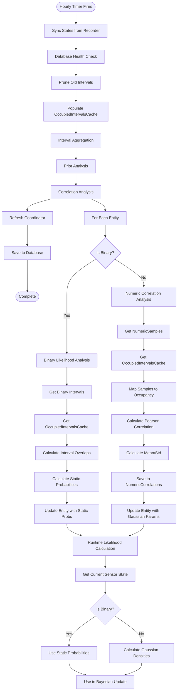

# Sensor Correlation Analysis Chain

This document provides a comprehensive breakdown of the sensor analysis chain, from data collection through likelihood calculation. It details how numeric sensors use correlation analysis with Gaussian PDFs, while binary sensors use duration-based static probability calculation.

## Table of Contents

1. [Complete Flow Overview](#complete-flow-overview)
2. [Phase-by-Phase Breakdown](#phase-by-phase-breakdown)
3. [Method Reference](#method-reference)
4. [Unified Architecture](#unified-architecture)

## Complete Flow Overview

The analysis chain consists of four main phases:

1. **Data Collection** (Continuous) - Raw sensor data is continuously synced from Home Assistant
2. **Hourly Analysis Cycle** (Scheduled) - Periodic analysis runs every hour
3. **Sensor Analysis** (Within Analysis Cycle) - Analyzes sensors using appropriate method:
   - **Numeric Sensors**: Correlation analysis with Gaussian PDFs
   - **Binary Sensors**: Duration-based static probability calculation
4. **Likelihood Calculation** (Runtime) - Retrieves likelihoods using appropriate method based on sensor type

## Phase-by-Phase Breakdown

### Phase 1: Data Collection (Continuous)

**Location**: `custom_components/area_occupancy/db/sync.py`

#### Step 1.1: Sync States from Recorder

**Method**: `sync_states()`

**What Happens**:

- Fetches recent state changes from Home Assistant recorder
- Converts numeric sensor states to `NumericSamples` records
- Converts binary sensor states to `Intervals` records
- Stores in database tables

**Data Stored**:

- `NumericSamples` table: Raw numeric sensor values with timestamps
- `Intervals` table: Binary sensor state intervals (on/off periods)

---

### Phase 2: Hourly Analysis Cycle (Scheduled)

**Location**: `custom_components/area_occupancy/coordinator.py::run_analysis()`

**Method**: `run_analysis()`

**Trigger**: Scheduled timer fires every hour

**Note**: The coordinator's `run_analysis()` method delegates to `run_full_analysis()` in `data/analysis.py`, which orchestrates the complete analysis chain.

#### Step 2.1: Sync States

Imports latest data from Home Assistant recorder into local database.

#### Step 2.2: Database Health Check & Pruning

Ensures database integrity and removes old data beyond retention period.

#### Step 2.3: Populate OccupiedIntervalsCache

**Location**: `custom_components/area_occupancy/data/analysis.py::ensure_occupied_intervals_cache()`

Calculates occupied intervals from motion sensors (ground truth) and caches them.

#### Step 2.4: Interval Aggregation

**Location**: `custom_components/area_occupancy/data/analysis.py::run_interval_aggregation()`

Aggregates raw intervals into daily/weekly/monthly aggregates for trend analysis.

#### Step 2.5: Prior Analysis

Calculates global prior probability and time-based priors for each area.

#### Step 2.6: Correlation Analysis

**Location**: `custom_components/area_occupancy/db/correlation.py::run_correlation_analysis()`

**Main analysis path** - Runs correlation analysis for all configured sensors (excluding motion sensors).

#### Step 2.7: Refresh & Save

Updates coordinator state and persists all changes to database.

---

### Phase 3: Correlation Analysis (Step 6 Detail)

**Location**: `custom_components/area_occupancy/db/correlation.py::run_correlation_analysis()`

#### Step 3.1: Get Correlatable Entities

**Location**: `custom_components/area_occupancy/db/correlation.py::get_correlatable_entities_by_area()`

**Method**: `get_correlatable_entities_by_area()`

**What Happens**:

- Returns all configured sensors for the area (excluding motion sensors).
- Identifies if each entity is binary or numeric.

#### Step 3.2: Analyze Each Entity

For each entity:

1. **Route by Type**:
   - **Binary Sensors**: Calls `analyze_binary_likelihoods()` for duration-based analysis.
   - **Numeric Sensors**: Calls `analyze_and_save_correlation()` for correlation analysis.

2. **Update Live Entity**:
   - **Binary Sensors**: Updates entity with `prob_given_true` and `prob_given_false` via `update_binary_likelihoods()`.
   - **Numeric Sensors**: Updates entity with `learned_gaussian_params` via `update_correlation()`.

**Location**: `custom_components/area_occupancy/db/correlation.py`

#### Step 3.3a: Binary Sensor Analysis

**Method**: `analyze_binary_likelihoods()`

**Process**:

1. **Get Occupied Intervals**:
   - Retrieves occupied intervals from `OccupiedIntervalsCache` for the analysis period.

2. **Get Binary Sensor Intervals**:
   - Queries `Intervals` table for the binary sensor's state changes.

3. **Calculate Overlaps**:
   - For each binary sensor interval, calculates overlap duration with occupied periods.
   - Calculates overlap duration with unoccupied periods.

4. **Calculate Probabilities**:
   - `prob_given_true = active_duration_occupied / total_occupied_duration`
   - `prob_given_false = active_duration_unoccupied / total_unoccupied_duration`

5. **Clamp and Return**:
   - Clamps probabilities between 0.05 and 0.95.
   - Returns static probability values.

#### Step 3.3b: Numeric Sensor Analysis

**Location**: `custom_components/area_occupancy/db/correlation.py`

**Method**: `analyze_correlation()`

**Process**:

1. **Data Retrieval**:
   - Queries `NumericSamples` directly for the analysis period.

2. **Map to Occupancy**:
   - Checks each sample timestamp against `OccupiedIntervalsCache`.
   - Creates parallel arrays of values and occupancy flags (0/1).

3. **Calculate Pearson Correlation**:
   - Determines relationship between value and occupancy.

4. **Calculate Statistics**:
   - Learns Mean/Std for Occupied state.
   - Learns Mean/Std for Unoccupied state.

5. **Save Result**:
   - Persists parameters to `NumericCorrelations` table.

---

### Phase 4: Likelihood Calculation (Runtime)

**Location**: `custom_components/area_occupancy/data/entity.py::get_likelihoods()`

This phase occurs at runtime whenever the Bayesian probability calculation needs likelihood values.

#### Step 4.1: Get Likelihoods

**Method**: `get_likelihoods()`

**What Happens**:

1. **Check Sensor Type**:

   - **Binary Sensors** (media, appliances, doors, windows):
     - If analysis has been run: Returns stored `prob_given_true` and `prob_given_false`.
     - If not analyzed: Returns `EntityType` default probabilities.

   - **Numeric Sensors**:
     - Gets current sensor state value.
     - If state is unavailable: Uses representative value (average of occupied/unoccupied means).
     - Calculates Gaussian densities using learned parameters.

2. **Calculate Probabilities**:

   - **Binary Sensors**: Returns static probabilities directly.
   - **Numeric Sensors**: Calculates $P(value | Occupied)$ and $P(value | Unoccupied)$ using Gaussian PDF.

3. **Return Probabilities**:
   - Returns the two probabilities for Bayesian update.

## Architecture Overview

The system uses different analysis methods optimized for each sensor type:

### Key Design Decisions:

1. **Numeric Sensors**: Use correlation analysis with Gaussian PDFs for dynamic, continuous likelihood calculation.
2. **Binary Sensors**: Use duration-based analysis for simple, reliable static probabilities.
3. **Motion Sensors**: Use configured static probabilities (not analyzed).

### Benefits:

- **Appropriate Methods**: Each sensor type uses the analysis method best suited to its data characteristics.
- **Dynamic Likelihoods (Numeric)**: Continuous values benefit from Gaussian PDF calculation.
- **Simple Reliability (Binary)**: Binary states benefit from straightforward duration-based probabilities.
- **Maintainability**: Clear separation of concerns between analysis methods.
- **Flexibility**: Easy to add new sensor types or analysis methods in the future.
