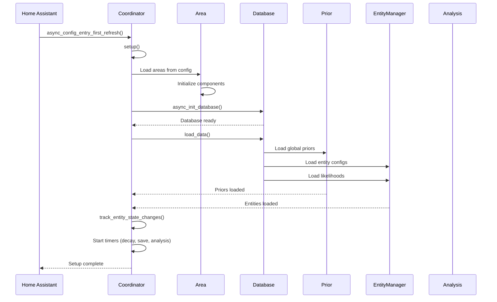
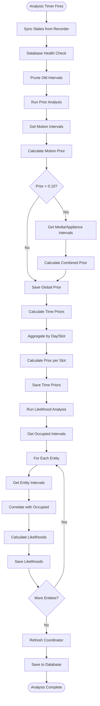
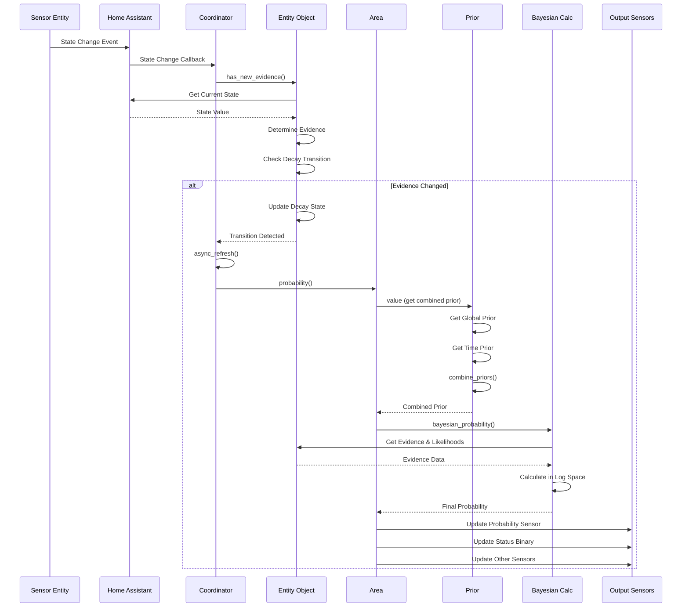
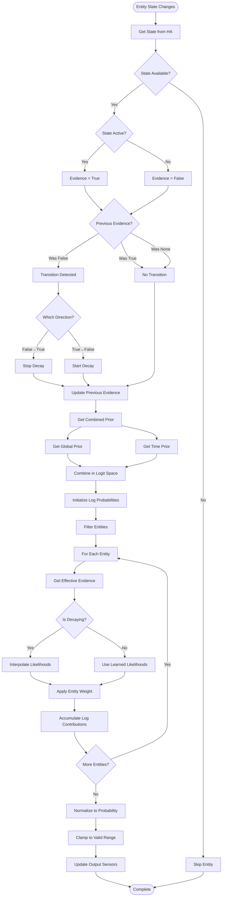
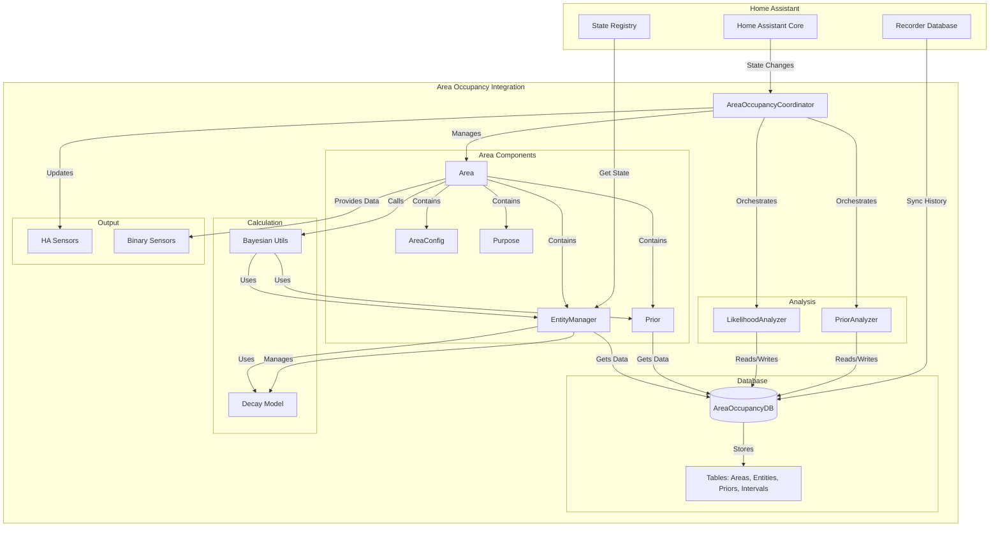
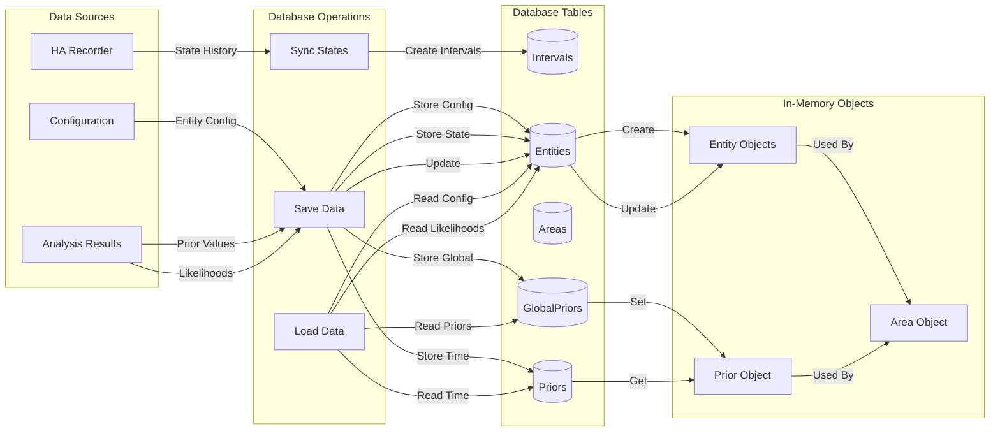
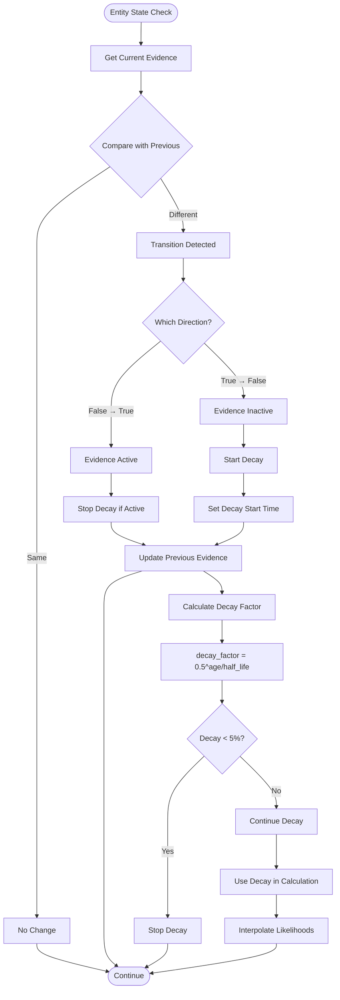

# Data Flow Diagrams

This document provides visual flow diagrams showing how data moves through the area occupancy calculation system.

## Initialization Flow

The initialization sequence diagram shows how the system sets up when Home Assistant starts:

## Learning Phase Flow

The learning phase flowchart shows how priors and likelihoods are learned from historical data:

## Real-Time Update Flow

The real-time update sequence diagram shows what happens when a sensor state changes:

## Entity State Change to Probability Update Flow

This flowchart shows the detailed flow from entity state change to final probability:

## Component Interaction Diagram

This graph shows how the main components interact:

## Database Data Flow

This diagram shows how data flows through the database:

## Decay Flow

This flowchart shows how decay is managed:

## See Also

- [Complete Calculation Flow](calculation-flow.md) - Detailed text explanation
- [Prior Calculation Deep Dive](prior-calculation.md) - Prior learning details
- [Likelihood Calculation Deep Dive](likelihood-calculation.md) - Likelihood learning details
- [Bayesian Calculation Deep Dive](bayesian-calculation.md) - Calculation details
- [Entity Evidence Collection](entity-evidence.md) - Evidence collection details

