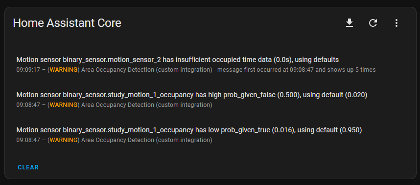
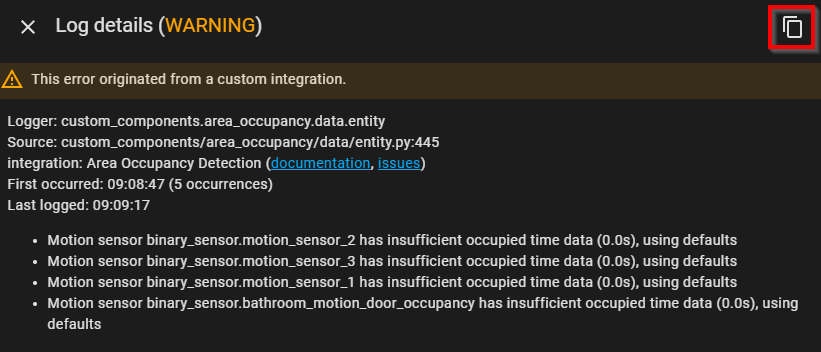

Below are the instructions for debugging the integration.

1. Enable debug logging
    - Add the following to the `configuration.yaml` file
    ```yaml
    logger:
      logs:
        custom_components.area_occupancy: DEBUG
    ```
    - Restart Home Assistant

2. Perform the action you want to debug
    - For example, if you want to debug the occupancy sensor, you can trigger a motion sensor to change the occupancy state
3. Check the logs in Home Assistant
    - Go to Settings
    - Click on "System"
    - Click on "Logs"
    - Look for the integration name (e.g. `area_occupancy or Area Occupancy Detection`)
    - Look for the debug messages, there may be warnings or errors. Warnings are not a problem, but errors are.
    
    - If there are errors, please open an issue on the [GitHub repository](https://github.com/Hankanman/area-occupancy-detection/issues)
    - Open the error in the logs and copy the error message
    
