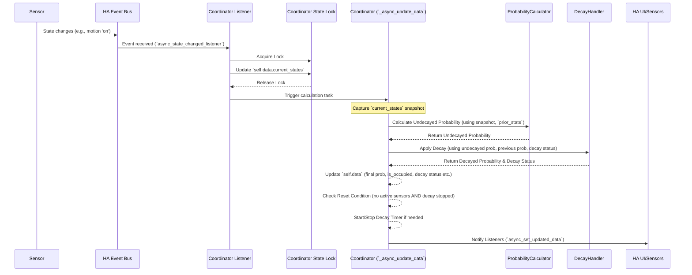
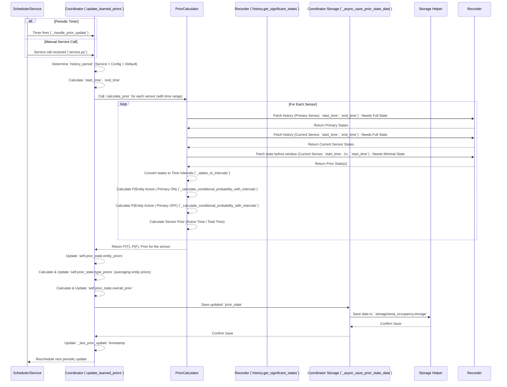

# Area Occupancy Probability Calculation Explained

This document details the process used by the `area_occupancy` custom component to calculate the probability of an area being occupied, including how historical data influences priors and how probability decays over time.

## Core Concepts

*   **Occupancy Probability:** The final output value (0.0 to 1.0, typically represented 0-100%) indicating the calculated likelihood that the area is currently occupied. This is the value exposed by the main probability sensor.
*   **Undecayed Probability:** The probability calculated based *only* on the current state of sensors and the learned priors, *before* any decay is applied.
*   **Prior Probability (Learned):** This isn't a single value but refers to the `PriorState` object stored by the component. It contains:
    *   **Entity Priors:** For each configured sensor, stores:
        *   `P(Active | Occupied)`: The learned probability that this sensor is active *given* the primary sensor indicates occupancy.
        *   `P(Active | Not Occupied)`: The learned probability that this sensor is active *given* the primary sensor indicates non-occupancy.
        *   `Prior`: The simple historical probability of this specific sensor being active over the analysis period.
    *   **Type Priors:** Aggregated averages of the `Entity Priors` grouped by sensor type (motion, media, light, etc.).
    *   **Overall Prior:** A baseline probability calculated from the `Type Priors` and their configured `Weights`. This represents a starting point before considering current sensor states.
    *   **Analysis Period:** The number of days (`history_period`) used for the historical analysis.
*   **Weights:** User-configured values (0.0 to 1.0) assigned to each *type* of sensor (motion, media, light, etc.), determining their relative influence on the probability calculation.
*   **Active States:** User-configured states for specific sensor types that are considered to indicate activity (e.g., `playing` for media players, `on` for motion sensors, `closed` for certain door configurations).
*   **Decay:** An exponential decrease in the occupancy probability over time when no sensors are reporting an "active" state. This simulates the diminishing certainty of occupancy as time passes without new evidence.
*   **Threshold:** A user-configured value (0-100%). If the final Occupancy Probability meets or exceeds this threshold, the main binary sensor state becomes `on` (Occupied).

## Data Flow and Components

*   **Coordinator (`coordinator.py`):** The central orchestrator.
    *   Holds the current state (`self.data`: `ProbabilityState`) and learned priors (`self.prior_state`: `PriorState`).
    *   Listens for state changes of configured entities.
    *   Triggers probability calculations.
    *   Manages the decay process and timer.
    *   Schedules and triggers periodic prior updates.
    *   Interacts with storage.
    *   Notifies HA of updates.
*   **Probability Calculator (`calculate_prob.py`):** Calculates the *current, undecayed* probability based on current sensor states and learned priors (`PriorState`).
*   **Prior Calculator (`calculate_prior.py`):** Calculates the *learned* priors (`PriorState`) based on historical data analysis.
*   **Decay Handler (`decay_handler.py`):** Applies the exponential decay logic to the calculated probability.
*   **Probabilities (`probabilities.py`):** Holds configuration data (weights, active states) and provides methods to access learned/default prior values from the `PriorState`.
*   **Storage (`storage.py`):** Handles saving and loading the learned `PriorState` object to/from the `.storage/area_occupancy.storage` file.
*   **Service (`service.py`):** Provides the `area_occupancy.update_priors` service to manually trigger prior recalculation.
*   **Home Assistant Core:** Provides entity states, history data (`recorder`), event listeners, and timers.

## Process Walkthrough

### 1. Initialization / Startup

1.  **Coordinator Starts:** The `AreaOccupancyCoordinator` is initialized for a configured area.
2.  **Load Config:** Merges configuration from `data` and `options` of the `ConfigEntry`.
3.  **Load Stored Priors:** Attempts to load the `PriorState` object for this area from `.storage/area_occupancy.storage` using `StorageManager`.
    *   If successful, `self.prior_state` is populated with learned values and `self._last_prior_update` timestamp is loaded.
    *   If unsuccessful (no file, error), `self.prior_state` is initialized with default values from `const.py` via `Probabilities`.
4.  **Initialize States:** Gets the *current* state of all configured sensors from `hass.states.get` and populates `self.data.current_states`.
5.  **Setup Listeners:** Starts listening for state changes (`async_track_state_change_event`) for all configured sensors.
6.  **Initial Prior Check:** Determines if priors need to be calculated immediately (based on whether they were loaded, are complete, and are recent enough compared to `self.prior_update_interval`). If needed, calls `update_learned_priors`.
7.  **Schedule Prior Updates:** Schedules the *next* periodic prior update using `_schedule_next_prior_update` (`async_track_point_in_time` for the start of the next hour).
8.  **Initial Refresh:** Performs an initial calculation (`async_refresh` -> `_async_update_data`) to establish the starting probability.

### 2. State Change Event

This is the most common trigger for recalculation.

1.  **Event Trigger:** A configured sensor changes state.
2.  **Listener Callback:** The `async_state_changed_listener` in `coordinator.py` receives the event.
3.  **State Update:** It acquires an `asyncio.Lock` (`self._state_lock`), updates the corresponding entry in `self.data.current_states` with the new state and availability, and releases the lock.
4.  **Trigger Calculation:** It schedules `_async_update_data` to run.
5.  **Snapshot & Previous State:** `_async_update_data` takes a snapshot of `self.data.current_states` (to ensure the calculation uses a consistent view) and copies the *old* `current_states` into `self.data.previous_states`. It also notes the probability *before* this calculation cycle (`initial_prob`).
6.  **Calculate Undecayed Probability:** Calls `ProbabilityCalculator.calculate_occupancy_probability`, passing the state snapshot and the `self.prior_state`.
    *   The calculator iterates through the sensors in the snapshot.
    *   For each sensor, it checks if its state is "active" using `self.probabilities.is_entity_active`.
    *   If active, it retrieves the learned conditional probabilities (`P(T)`, `P(F)`) for that *entity* from `self.prior_state.entity_priors` and the configured *type* weight from `self.probabilities`.
    *   It combines these using a Bayesian-like approach (the exact formula isn't shown but likely involves weighting the evidence from active sensors against the overall prior).
    *   It returns the calculated *undecayed* probability.
7.  **Apply Decay:** Calls `DecayHandler.calculate_decay`, passing the newly calculated *undecayed* probability, the `initial_prob` (from before this cycle), and the current decay status (`decaying`, `decay_start_time`, etc.).
    *   If decay is enabled *and* the probability hasn't increased, it calculates how much time has passed since decay started (or since the last update if decay is ongoing).
    *   It applies an exponential decay factor based on `DECAY_LAMBDA` and the configured `decay_window`.
    *   It returns the potentially lower *decayed* probability and updated decay status flags/timestamps.
8.  **Update Final State:** Updates `self.data` with the final *decayed* probability, the corresponding `is_occupied` state (based on the threshold), and the new decay status.
9.  **Reset Check:** Checks if there are *any* active sensors in the snapshot *and* if the decay process is currently stopped (`decaying=False`). If both conditions are true (no activity, decay finished), it resets the probability to `MIN_PROBABILITY` and `is_occupied` to `False`.
10. **Manage Decay Timer:** If `self.data.decaying` is true, it ensures the 5-second decay timer (`async_track_time_interval` calling `_async_do_decay_update`) is running. If false, it stops the timer. The timer callback simply triggers another `async_request_refresh` -> `_async_update_data` cycle to apply further decay.
11. **Notify Listeners:** Calls `self.async_set_updated_data(self.data)` to push the updated state to all sensors/UI elements associated with this coordinator.

### 3. Prior Calculation (Periodic / Manual)

This process runs independently to learn from history.

1.  **Trigger:** Either the hourly timer fires (`_handle_prior_update`) or the `area_occupancy.update_priors` service is called.
2.  **Determine Period:** The `update_learned_priors` method determines the `history_period` (days) to use, prioritizing the service call parameter, then the configured value, then the default. It calculates the `start_time` and `end_time` for the history query.
3.  **Iterate Sensors:** Loops through all configured sensors.
4.  **Fetch History:** For each sensor, calls `PriorCalculator.calculate_prior`. This method calls `_get_states_from_recorder` (which uses `recorder.history.get_significant_states`) twice:
    *   Once for the *primary* occupancy sensor over the full period. Requires full state objects (`minimal_response=False`) to get `last_changed`.
    *   Once for the *current* sensor being analyzed over the full period. Requires full state objects.
5.  **Fetch Prior State:** `PriorCalculator._states_to_intervals` makes another call to `get_significant_states` for a tiny (1-second) window *before* the main `start_time`. This uses `minimal_response=True` and `significant_changes_only=False` to efficiently get the state value just before the analysis window begins.
6.  **Calculate Intervals:** `_states_to_intervals` converts the list of `State` objects (from step 4 & 5) into a list of `StateInterval` dictionaries, each representing a period during which the sensor held a specific state.
7.  **Calculate Probabilities (Non-Primary):**
    *   Calculates the simple prior for the current sensor (total active time / total time).
    *   Calls `_calculate_conditional_probability_with_intervals` twice:
        *   Calculates P(Entity Active | Primary=ON) by finding the overlap duration between the entity's active intervals and the primary sensor's ON intervals, divided by the total duration the primary sensor was ON.
        *   Calculates P(Entity Active | Primary=OFF) similarly, using the primary sensor's OFF intervals.
8.  **Calculate Probabilities (Primary):** If the sensor *is* the primary, it calculates its simple prior (active time / total time) and assigns fixed high/low values for P(T) (0.9) and P(F) (0.1).
9.  **Update `prior_state`:** The results (P(T), P(F), Prior) for the successfully calculated sensor are stored in `self.prior_state.entity_priors`.
10. **Update Type Priors:** After looping through all sensors, `_update_type_priors_from_entities` averages the newly learned `entity_priors` for each sensor type and updates `self.prior_state.type_priors`.
11. **Update Overall Prior:** Calculates the new `overall_prior` based on the updated `type_priors` and configured weights, updating `self.prior_state.overall_prior`.
12. **Save Priors:** Calls `_async_save_prior_state_data` which uses `StorageManager` to save the entire updated `self.prior_state` object to the JSON storage file (`.storage/area_occupancy.storage`).
13. **Update Timestamp:** Sets `self._last_prior_update` to the current time.
14. **Reschedule:** Schedules the next hourly update.

## Summary

The `area_occupancy` component uses a two-pronged approach:

1.  **Real-time Calculation:** Responds instantly to sensor state changes, calculating an undecayed probability based on current states and learned priors, applies exponential decay if no activity is present, determines the final occupancy state based on a threshold, and updates HA sensors.
2.  **Periodic Learning:** Runs in the background (typically hourly or on demand) to analyze historical sensor data, comparing each sensor's activity against the primary sensor's state to learn conditional probabilities (Priors). These learned priors refine the accuracy of the real-time calculations.

This combination allows the component to react quickly while continuously improving its understanding of how different sensors correlate with actual occupancy in that specific area over time.
