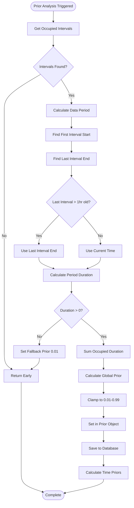
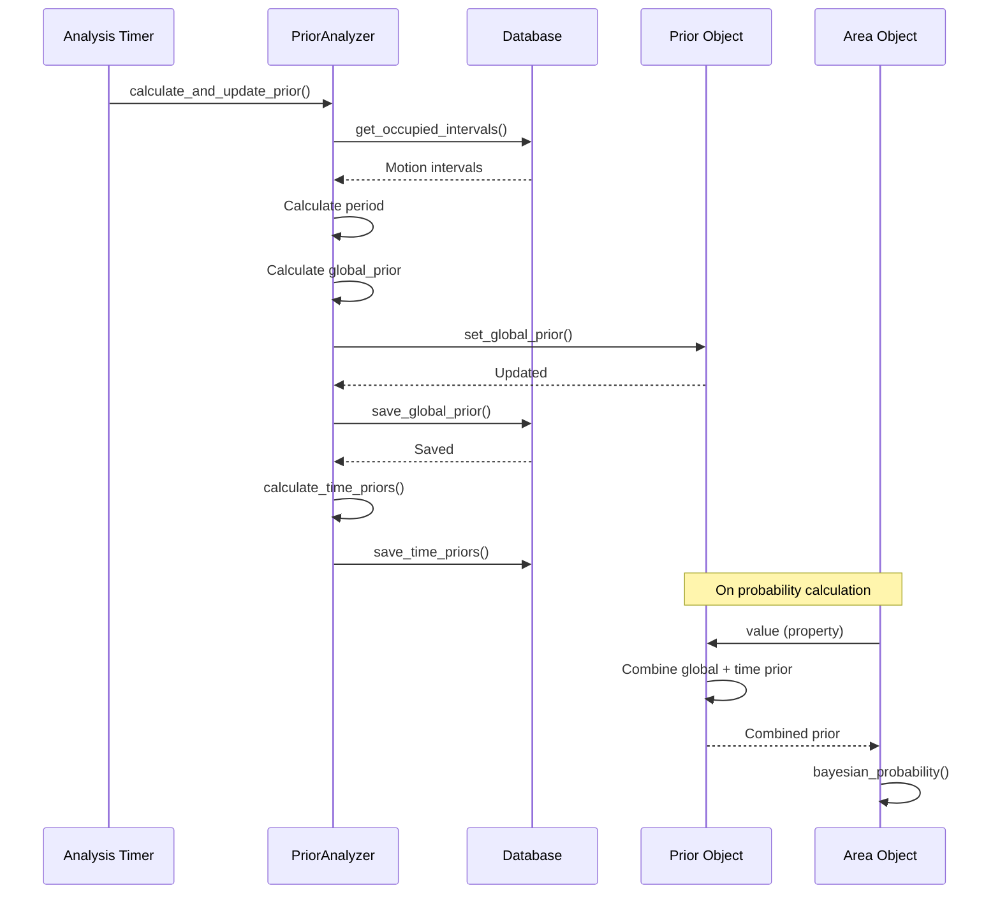

# Global Prior Calculation Flow

## Overview

The global prior represents the baseline probability that an area is occupied, calculated from historical motion sensor data. It serves as the foundation for Bayesian probability calculations, providing a learned estimate of occupancy based on past behavior patterns.

**Purpose**: The global prior captures the overall occupancy rate of an area over time, independent of time-of-day patterns. This is combined with time-specific priors (time priors) to create a more accurate baseline probability.

## Key Concepts

- **Global Prior**: Overall occupancy probability for an area (e.g., "this room is occupied 30% of the time")
- **Time Prior**: Time-of-day and day-of-week specific occupancy probability (e.g., "this room is occupied 80% of the time on weekdays at 7 PM")
- **Combined Prior**: The final prior used in Bayesian calculations, combining global and time priors

## Calculation Algorithm

The global prior is calculated using a simple ratio:

```python
global_prior = total_occupied_time / total_period_duration
```

Where:

- `total_occupied_time`: Sum of all occupied interval durations (from motion sensors)
- `total_period_duration`: Duration from first interval to last interval (or current time)

### Period Calculation

The system uses the **actual data period** rather than a fixed lookback window:

1. **First Interval Start**: Earliest motion sensor interval start time
2. **Last Interval End**: Latest motion sensor interval end time
3. **Period End Determination**:
   - If last interval is more than 1 hour old: Use `last_interval_end`
   - Otherwise: Use current time (`now`)

This approach ensures the prior reflects the actual data available, not an arbitrary time window.

### Clamping

The calculated prior is clamped to the range `[0.01, 0.99]` to prevent extreme values that could skew Bayesian calculations:

```python
global_prior = max(0.01, min(0.99, occupied_duration / actual_period_duration))
```

## Complete Flow

### Entry Points

The global prior calculation can be triggered from several entry points:

1. **Scheduled Analysis** (`run_full_analysis()`)
   - Location: `custom_components/area_occupancy/data/analysis.py:25`
   - Triggered by analysis timer (typically every 24 hours)
   - Runs for all configured areas

2. **Area-Level Analysis** (`area.run_prior_analysis()`)
   - Location: `custom_components/area_occupancy/area/area.py:151`
   - Can be called directly for a specific area

3. **Manual Trigger** (`start_prior_analysis()`)
   - Location: `custom_components/area_occupancy/data/analysis.py:155`
   - Wrapper function for async execution

### Step-by-Step Calculation Process



### Detailed Steps

#### Step 1: Get Occupied Intervals

**Location**: `custom_components/area_occupancy/data/analysis.py:217`

```python
occupied_intervals = self.get_occupied_intervals(days)
```

- Queries motion sensor intervals from the database
- Intervals are already merged and extended with motion timeout
- Uses `OccupiedIntervalsCache` when available for performance
- Returns list of `(start_time, end_time)` tuples

**Data Source**: `Intervals` table filtered by:

- Motion sensor entities only (`entity_type == "motion"`)
- State == "on"
- Within lookback period (default: 90 days)

#### Step 2: Calculate Data Period

**Location**: `custom_components/area_occupancy/data/analysis.py:247-264`

```python
first_interval_start = min(start for start, end in occupied_intervals)
last_interval_end = max(end for start, end in occupied_intervals)
now = dt_util.utcnow()

if (now - last_interval_end).total_seconds() > 3600:
    actual_period_end = last_interval_end
else:
    actual_period_end = now

actual_period_duration = (actual_period_end - first_interval_start).total_seconds()
```

**Rationale**: Using actual data period instead of fixed lookback ensures:

- Prior reflects actual data availability
- No artificial inflation from empty periods
- More accurate representation of occupancy patterns

**Edge Case Handling**: If duration is zero or negative (bad timestamps or clock skew), the system sets a safe fallback prior of 0.01 and returns early.

#### Step 3: Calculate Global Prior

**Location**: `custom_components/area_occupancy/data/analysis.py:285-296`

```python
occupied_duration = sum(
    (end - start).total_seconds()
    for start, end in occupied_intervals
)

global_prior = max(
    0.01, min(0.99, occupied_duration / actual_period_duration)
)
```

**Calculation**: Simple ratio of occupied time to total period duration.

**Clamping**: Values are clamped to `[0.01, 0.99]` to prevent:

- Zero priors (would make Bayesian calculation impossible)
- Extreme priors (would dominate Bayesian updates)

#### Step 4: Update In-Memory Prior

**Location**: `custom_components/area_occupancy/data/analysis.py:299`

```python
self.area.prior.set_global_prior(global_prior)
```

- Updates the `Prior` object's `global_prior` attribute
- Invalidates time prior cache (forces reload on next access)
- Updates `_last_updated` timestamp

#### Step 5: Save to Database

**Location**: `custom_components/area_occupancy/data/analysis.py:309-320`

```python
success = self.db.save_global_prior(
    area_name=self.area_name,
    prior_value=global_prior,
    data_period_start=first_interval_start,
    data_period_end=actual_period_end,
    total_occupied_seconds=occupied_duration,
    total_period_seconds=actual_period_duration,
    interval_count=len(occupied_intervals),
    calculation_method="interval_analysis",
)
```

**Storage**: Saves to `GlobalPriors` table with full metadata:

- Prior value
- Calculation date
- Data period (start/end)
- Total occupied seconds
- Total period seconds
- Interval count
- Calculation method

**Persistence**: Only the most recent calculation is kept per area (older calculations are pruned, keeping last 15).

## Storage and Retrieval

### Database Schema

**Table**: `GlobalPriors` (`custom_components/area_occupancy/db/schema.py:424`)

| Column                   | Type            | Description                              |
| ------------------------ | --------------- | ---------------------------------------- |
| `id`                     | Integer (PK)    | Auto-increment primary key               |
| `entry_id`               | String          | Integration entry ID                     |
| `area_name`              | String (Unique) | Area name                                |
| `prior_value`            | Float           | Global prior probability                 |
| `calculation_date`       | DateTime        | When prior was calculated                |
| `data_period_start`      | DateTime        | Start of data period used                |
| `data_period_end`        | DateTime        | End of data period used                  |
| `total_occupied_seconds` | Float           | Total occupied time in period            |
| `total_period_seconds`   | Float           | Total period duration                    |
| `interval_count`         | Integer         | Number of intervals used                 |
| `confidence`             | Float           | Confidence in calculation (0.0-1.0)      |
| `calculation_method`     | String          | Method used                              |
| `underlying_data_hash`    | String          | Hash of underlying data (for validation) |
| `created_at`             | DateTime        | Creation timestamp                       |
| `updated_at`             | DateTime        | Last update timestamp                    |

**Indexes**:

- Unique constraint on `area_name` (one global prior per area)
- Index on `calculation_date` (for history tracking)

### Loading from Database

**Location**: `custom_components/area_occupancy/db/operations.py:223-228`

```python
global_prior_data = await db.hass.async_add_executor_job(
    db.get_global_prior, area_name
)
if global_prior_data:
    area_data.prior.set_global_prior(global_prior_data["prior_value"])
```

**Query Function**: `get_global_prior()` (`custom_components/area_occupancy/db/queries.py:348`)

- Queries `GlobalPriors` table by `area_name`
- Returns dictionary with prior metadata
- Returns `None` if no prior found (prior defaults to `MIN_PRIOR`)

**When Loaded**: During `load_data()` call on integration startup or reload.

### Saving to Database

**Location**: `custom_components/area_occupancy/db/operations.py:905`

**Function**: `save_global_prior()`

- Updates existing record or creates new one
- Prunes old history (keeps last 15 calculations per area)
- Creates data hash for validation
- Handles errors gracefully (returns False on failure)

## Integration with Time Priors

The global prior is combined with time priors to create a more accurate baseline:

**Location**: `custom_components/area_occupancy/data/prior.py:66-103`

```python
@property
def value(self) -> float:
    if self.global_prior is None:
        result = MIN_PRIOR
    else:
        if self.time_prior is None:
            prior = self.global_prior
        else:
            prior = combine_priors(self.global_prior, self.time_prior)

        # Apply PRIOR_FACTOR (1.05) and clamp
        adjusted_prior = prior * PRIOR_FACTOR
        result = max(MIN_PRIOR, min(MAX_PRIOR, adjusted_prior))

    # Apply min_prior_override if configured
    if self.config.min_prior_override > 0.0:
        result = max(result, self.config.min_prior_override)

    return result
```

**Combination Method**: Uses logit space combination (`combine_priors()` function) to properly combine probabilities.

**PRIOR_FACTOR**: Multiplier of 1.05 applied to slightly increase prior (accounts for sensor limitations).

## Usage in Probability Calculations

The global prior (combined with time prior) is used as the baseline in Bayesian probability calculations:

**Location**: `custom_components/area_occupancy/area/area.py:183-196`

```python
def probability(self) -> float:
    entities = self.entities.entities
    if not entities:
        return MIN_PROBABILITY

    return bayesian_probability(
        entities=entities,
        prior=self.prior.value,  # Uses combined prior (global + time)
    )
```

**Bayesian Update**: Each entity's evidence updates the prior probability using Bayes' theorem.

## Data Flow Diagram



## Troubleshooting

### Global Prior Not Persisting

**Symptom**: Global prior is lost on Home Assistant restart.

**Cause**: Prior was calculated but not saved to database.

**Solution**: Ensure `save_global_prior()` is called after calculation. Check logs for save errors.

### Prior Always Default Value

**Symptom**: Prior always returns `MIN_PRIOR` (0.01).

**Possible Causes**:

1. No motion sensor intervals found
2. Intervals not synced from recorder
3. Database query failing

**Solution**:

- Check motion sensors are configured
- Verify intervals exist in database
- Check logs for query errors

### Invalid Period Duration

**Symptom**: Warning about invalid period duration, fallback prior used.

**Cause**: Bad timestamps or clock skew causing negative/zero duration.

**Solution**: Check system clock synchronization, verify interval timestamps.

### Prior Not Loading on Startup

**Symptom**: Prior defaults to `MIN_PRIOR` even though it was calculated.

**Possible Causes**:

1. `load_data()` not called
2. Database query failing
3. Prior not saved previously

**Solution**: Check `load_data()` is called during setup, verify database connection.

## Known Issues and Limitations

1. **Period Calculation Edge Case**: The 1-hour threshold for determining `actual_period_end` may cause issues if last interval is exactly 1 hour old (uses last interval end instead of current time).

2. **No Validation of Loaded Prior**: Loaded prior from database is set without validation that it's still valid or within expected bounds.

3. **Race Conditions**: If multiple areas calculate priors simultaneously, database operations may conflict (though SQLite handles this gracefully).

4. **Missing Error Handling**: If `save_global_prior()` fails, calculation continues but prior is lost (should log warning).

## Related Documentation

- [Time Prior Flow](time-prior-flow.md) - Time-of-day specific priors
- [Database Schema](database-schema.md) - Complete database structure
- [Data Flow](data-flow.md) - Overall data flow through system
- [Prior Learning](../features/prior-learning.md) - User-facing prior learning documentation
- [Bayesian Calculation](bayesian-calculation.md) - How priors are used in calculations
