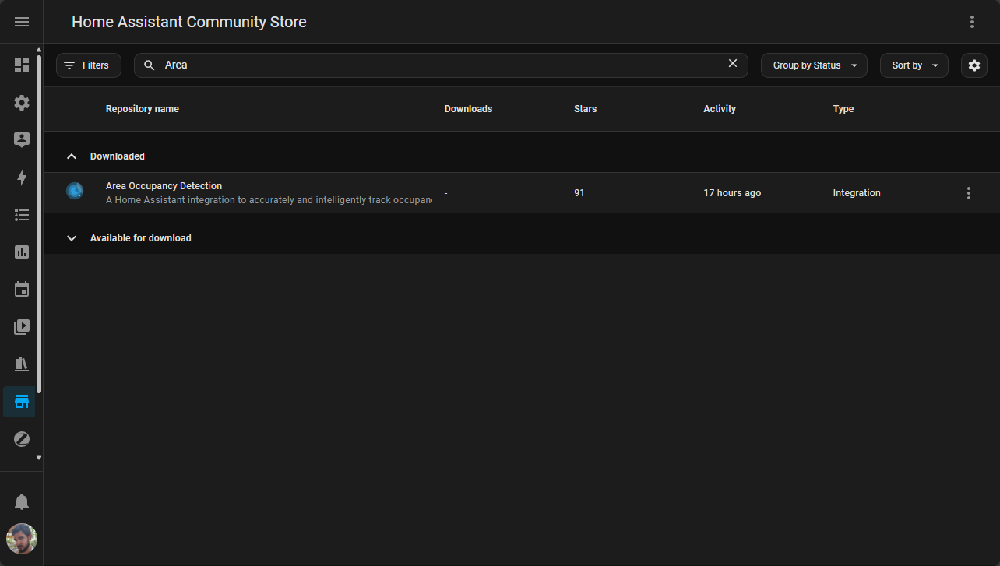
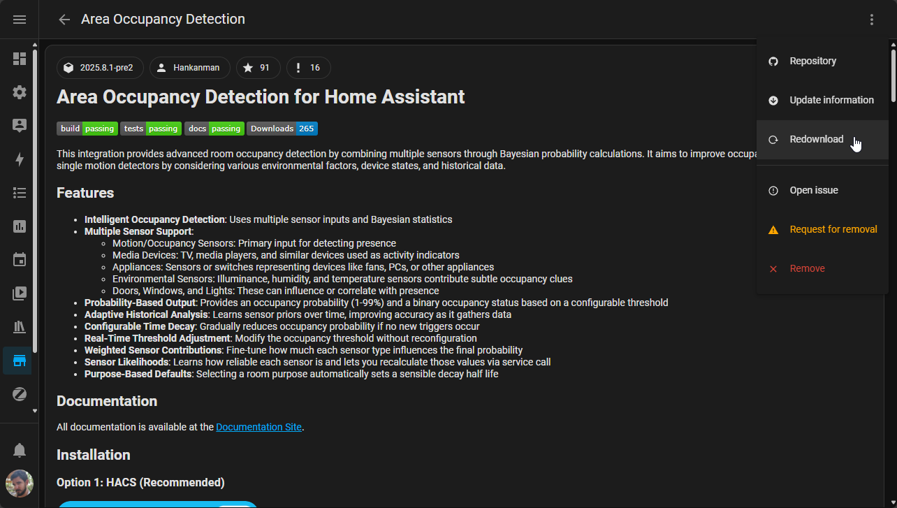
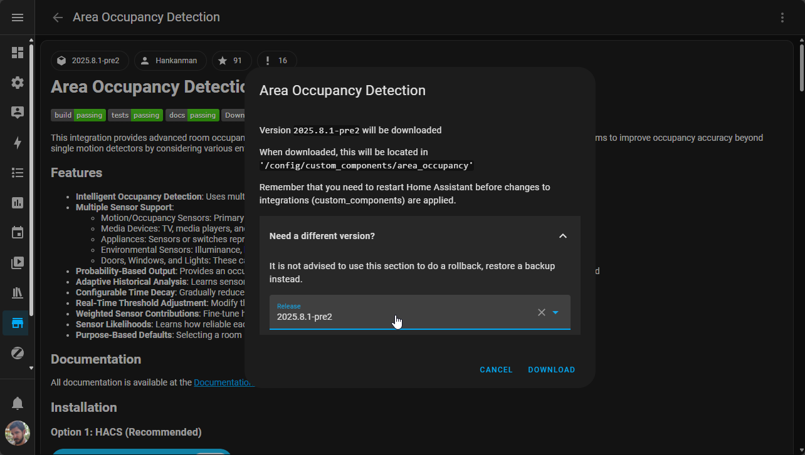

You are always welcome and encouraged to contribute to the project. Trying out the pre-releases and submitting feedback/issues is a great way to help.

## Installing Pre-releases

You can try out the pre-releases by downloading them via HACS. You can find the available pre-releases on the [releases](https://github.com/Hankanman/Area-Occupancy-Detection/releases) page.

1. Go to HACS
2. Search for "Area Occupancy Detection"
    
3. Select the integration
4. Use the "three dots" menu and select "Redownload"
    
5. Select the version you want to install after expanding the "Need a different version?" section (e.g. `2025.8.1-pre2`) and click on "Download"
    
6. Restart Home Assistant

## Issues

If you find any issues, please report them in the [issue tracker](https://github.com/Hankanman/Area-Occupancy-Detection/issues).

## Discussions

If you have any feedback, please share it in the [discussions](https://github.com/Hankanman/Area-Occupancy-Detection/discussions) section.

