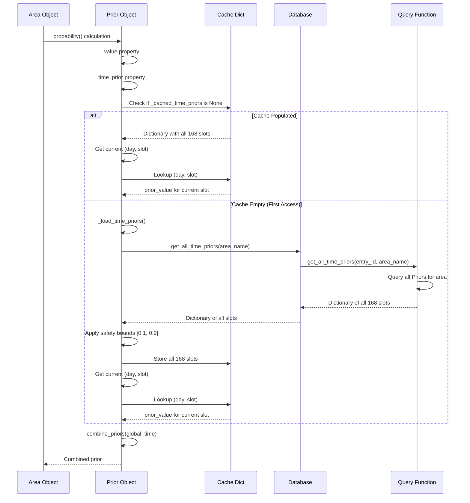
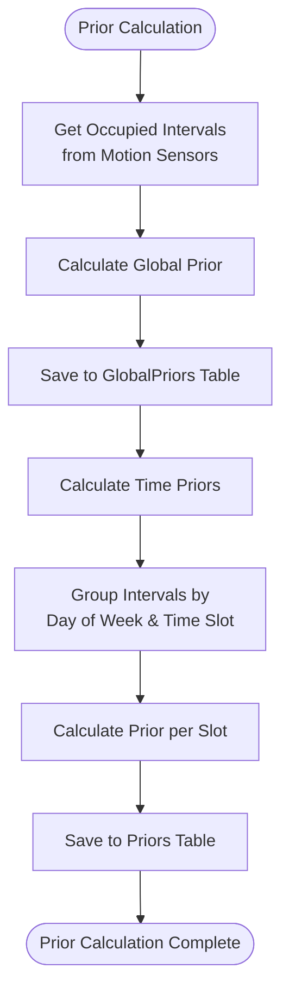

# Time Prior Feature - Complete Code Flow Documentation

## Overview

The time prior feature provides time-of-day and day-of-week specific occupancy probabilities. This document provides a comprehensive deep dive into how time priors work, including data sources, calculation, storage, retrieval, and usage in probability calculations.

**Implementation Status**: Time priors are **fully implemented**. The system calculates time priors from historical data during the analysis cycle and stores them in the database for efficient retrieval at runtime.

## Table of Contents

1. [Data Sources and Input Flow](#data-sources-and-input-flow)
2. [Time Prior Calculation](#time-prior-calculation)
3. [Storage Mechanism](#storage-mechanism)
4. [Retrieval at Runtime](#retrieval-at-runtime)
5. [Usage in Probability Calculation](#usage-in-probability-calculation)
6. [Code Flow Diagrams](#code-flow-diagrams)
7. [Implementation Notes](#implementation-notes)

## Data Sources and Input Flow

### 1.1 Historical Data Collection

**Source**: Home Assistant Recorder database

**Process**: `sync_states()` in `db/sync.py` imports state history from Home Assistant's recorder

**Storage**: Raw intervals stored in `intervals` table with:

- `entity_id`: The sensor entity ID
- `state`: The sensor state (e.g., "on", "off")
- `start_time`: When the state change occurred
- `end_time`: When the next state change occurred
- `duration_seconds`: Duration of this interval
- `area_name`: The area this interval belongs to

**Ground Truth**: Motion sensors exclusively (see `queries.py:get_occupied_intervals()`)

The system uses motion sensors as the "ground truth" for occupancy because they are the most direct indicator of human presence and rarely generate false positives.

### 1.2 Occupied Intervals Calculation

**Location**: `db/queries.py:get_occupied_intervals()`

**Method**:

1. Queries motion sensor intervals from `intervals` table filtered by:
   - `entry_id`: Integration entry ID
   - `area_name`: Specific area
   - `entity_type == InputType.MOTION.value`: Only motion sensors
   - `state == "on"`: Only active motion intervals
   - `start_time >= lookback_date`: Within lookback period

2. Merges overlapping intervals using `utils.py:merge_overlapping_intervals()`
   - Combines intervals that overlap or are adjacent
   - Prevents double-counting of occupied time

3. Applies motion timeout extension using `utils.py:apply_motion_timeout()`
   - Extends intervals by the motion timeout period (default: 5 minutes)
   - Accounts for time after motion stops when area may still be occupied

**Output**: List of `(start_time, end_time)` tuples representing occupied periods

**Example**:

```python
intervals = [
    (datetime(2024, 1, 1, 9, 0), datetime(2024, 1, 1, 9, 15)),
    (datetime(2024, 1, 1, 9, 12), datetime(2024, 1, 1, 9, 30)),  # Overlaps with first
    (datetime(2024, 1, 1, 14, 0), datetime(2024, 1, 1, 14, 5)),
]
# After merging and timeout extension:
merged = [
    (datetime(2024, 1, 1, 9, 0), datetime(2024, 1, 1, 9, 35)),  # Merged + timeout
    (datetime(2024, 1, 1, 14, 0), datetime(2024, 1, 1, 14, 10)),  # Extended by timeout
]
```

### 1.3 Caching Layer

**Table**: `occupied_intervals_cache` (see `schema.py:OccupiedIntervalsCache`)

**Purpose**: Precomputed occupied intervals to avoid recalculation

**Population**: `operations.py:save_occupied_intervals_cache()`

- Called during analysis cycle
- Stores merged and extended intervals
- Includes `calculation_date` for cache validity checking

**Validity Check**: `queries.py:is_occupied_intervals_cache_valid()`

- Checks if cache is less than 24 hours old (default)
- Returns `False` if cache is stale or missing

**Usage**: The cache is used by prior analysis to avoid recalculating occupied intervals from raw sensor data.

## Time Prior Calculation

### 2.1 Implementation Overview

Time priors are calculated during the analysis cycle by the `PriorAnalyzer` class. The calculation occurs automatically after global prior calculation, using the same occupied intervals data.

**Location**: `data/analysis.py:PriorAnalyzer.calculate_time_priors()`

**Grid**: 168 time slots (24 hours × 7 days)

- Each slot represents one hour on a specific day of week
- Day of week: 0=Monday, 1=Tuesday, ..., 6=Sunday
- Time slot: 0=00:00-01:00, 1=01:00-02:00, ..., 23=23:00-24:00

### 2.2 Calculation Process

The calculation follows these steps:

1. **Get Occupied Intervals**: Uses the same occupied intervals calculated for global prior analysis (from motion sensors, merged and extended with motion timeout).

2. **Process Each Interval**: For each occupied interval:
   - Iterates through all time slots the interval overlaps with
   - Calculates the overlap duration for each slot
   - Tracks which week each overlap belongs to (for data point counting)

3. **Calculate Per-Slot Statistics**:
   - **Occupied Seconds**: Sum of all overlap durations for each slot
   - **Data Points**: Number of unique weeks with data for each slot
   - **Total Slot Seconds**: `data_points × 3600` (seconds per hour)

4. **Calculate Prior Values**:
   - For each slot: `prior_value = occupied_seconds / total_slot_seconds`
   - Applies safety bounds: clamps to [0.1, 0.9] range
   - Only calculates priors for slots with data (missing slots default to 0.5 at retrieval)

5. **Save to Database**: Calls `save_time_priors()` to store all calculated priors with metadata:
   - `prior_value`: The calculated probability
   - `data_points`: Number of weeks with data
   - `confidence`: Calculated as `min(1.0, data_points / 4.0)` (4 weeks = full confidence)
   - `sample_period_start/end`: The data period used
   - `calculation_method`: "interval_analysis"

**Note**: Only motion sensors are used for time prior calculation (no media/appliance fallback).

**Safety Bounds**: The system bounds time-specific probabilities between 10% and 90% to prevent extreme values from dominating the calculation.

### 2.3 Integration Point

**Called From**: `data/analysis.py:PriorAnalyzer.calculate_and_update_prior()` (line 303-337)

**Timing**: After global prior calculation completes successfully

**Error Handling**: If time prior calculation fails, it logs a warning but does not prevent global prior from being saved. The system continues to function using only the global prior until the next analysis cycle.

## Storage Mechanism

### 3.1 Database Schema

**Table**: `priors` (see `schema.py:176-247`)

**Primary Key**: Composite of `(area_name, day_of_week, time_slot)`

- Ensures one prior value per area per time slot
- Allows efficient lookup by area and time slot

**Columns**:

| Column                  | Type            | Description                                    |
| ----------------------- | --------------- | ---------------------------------------------- |
| `entry_id`              | String          | Integration entry ID (same for all priors)     |
| `area_name`             | String (PK, FK) | Area name (foreign key to `areas` table)       |
| `day_of_week`           | Integer (PK)    | Day of week (0=Monday, 6=Sunday)               |
| `time_slot`             | Integer (PK)    | Time slot (0-23 for hourly slots)              |
| `prior_value`           | Float           | Prior probability for this slot (0.0-1.0)     |
| `data_points`           | Integer         | Number of data points used in calculation      |
| `confidence`            | Float           | Confidence in calculation (0.0-1.0, nullable) |
| `last_calculation_date` | DateTime        | When prior was last calculated (nullable)       |
| `sample_period_start`   | DateTime        | Start of data period used (nullable)           |
| `sample_period_end`     | DateTime        | End of data period used (nullable)             |
| `calculation_method`    | String          | Method used (e.g., "interval_analysis", nullable) |
| `last_updated`          | DateTime        | Last update timestamp                          |

**Indexes**:

- `idx_priors_entry` on `entry_id`: Fast filtering by integration
- `idx_priors_area` on `area_name`: Fast filtering by area
- `idx_priors_entry_area` on `(entry_id, area_name)`: Composite index for area queries
- `idx_priors_day_slot` on `(day_of_week, time_slot)`: Fast lookup by time slot
- `idx_priors_last_updated` on `last_updated`: For tracking recalculations

**Relationships**:

- Many-to-one with `areas` table via `area_name` foreign key

### 3.2 Storage Operations

**Location**: `db/operations.py:save_time_priors()` (line 1000)

**Function Signature**:

```python
def save_time_priors(
    db: AreaOccupancyDB,
    area_name: str,
    time_priors: dict[tuple[int, int], float],  # (day_of_week, time_slot) -> prior_value
    data_period_start: datetime,
    data_period_end: datetime,
    data_points_per_slot: dict[tuple[int, int], int],  # (day_of_week, time_slot) -> weeks
    calculation_method: str = "interval_analysis",
) -> bool:
```

**Implementation Details**:

- Processes all time priors in a single database transaction
- For each slot, checks if a record exists:
  - **If exists**: Updates `prior_value`, `data_points`, `confidence`, `last_calculation_date`, `sample_period_start/end`, `calculation_method`
  - **If new**: Creates a new `Priors` record with all fields populated
- Calculates confidence as `min(1.0, data_points / 4.0)` where 4 weeks = full confidence
- Uses bulk operations for efficiency
- Returns `True` on success, `False` on error
- Logs debug information about number of slots saved/updated

## Retrieval at Runtime

### 4.1 Retrieval Flow

The time prior retrieval follows this path:

1. **Entry Point**: `prior.py:Prior.time_prior` property (line 115)
   - Called when calculating combined prior
   - Property getter that triggers retrieval if needed

2. **Cache Check**: Checks if `_cached_time_priors` dictionary is populated (line 118)
   - If `None`, triggers `_load_time_priors()` to load all 168 slots from database
   - Cache stores all time priors as a dictionary: `(day_of_week, time_slot) -> prior_value`

3. **Load All Time Priors**: `prior.py:_load_time_priors()` (line 161)
   - Calls `db.get_all_time_priors()` to retrieve all time priors for the area
   - Loads all 168 slots in a single database query for efficiency
   - Applies safety bounds [0.1, 0.9] to all values during loading
   - Falls back to default values if database query fails

4. **Database Method**: `db/core.py:get_all_time_priors()` (line 304)
   - Wrapper that adds `entry_id` parameter
   - Calls query function

5. **Query Function**: `queries.py:get_all_time_priors()` (line 111)
   - Queries `Priors` table filtered by:
     - `entry_id`: Integration entry ID
     - `area_name`: Area name
   - Returns dictionary mapping `(day_of_week, time_slot)` to `prior_value`
   - Fills in missing slots with `default_prior` (0.5) to ensure all 168 slots are present

6. **Get Current Slot**: After cache is loaded, retrieves value for current day/slot (line 121-126)
   - Gets current `day_of_week` and `time_slot`
   - Looks up value in cached dictionary
   - Returns `DEFAULT_TIME_PRIOR` (0.5) if slot not found (shouldn't happen after `get_all_time_priors()`)

7. **Safety Bounds**: Applied during `_load_time_priors()` (line 173-177)
   - Clamps all values to [TIME_PRIOR_MIN_BOUND, TIME_PRIOR_MAX_BOUND] = [0.1, 0.9]
   - Prevents extreme values from affecting calculations

### 4.2 Time Slot Calculation

**Day of Week**: `prior.py:day_of_week` property (line 156)

- Uses `dt_util.utcnow().weekday()`
- Returns 0=Monday, 1=Tuesday, ..., 6=Sunday

**Time Slot**: `prior.py:time_slot` property (line 161)

- Calculates: `(now.hour * 60 + now.minute) // DEFAULT_SLOT_MINUTES`
- `DEFAULT_SLOT_MINUTES = 60` (line 39)
- Returns 0-23 for hourly slots

**Example**:

```python
# Monday at 14:30
day_of_week = 0  # Monday
time_slot = (14 * 60 + 30) // 60 = 14  # 14:00-15:00 slot
```

### 4.3 Caching Strategy

**Cache Structure**: `_cached_time_priors` dictionary

- Stores all 168 time priors: `dict[tuple[int, int], float]`
- Key: `(day_of_week, time_slot)` tuple
- Value: `prior_value` (already clamped to [0.1, 0.9])
- Loaded once per `Prior` instance lifecycle

**Cache Population**:

- Loaded lazily on first access to `time_prior` property
- Loads all 168 slots in a single database query for efficiency
- Applied safety bounds during loading

**Cache Invalidation**: `_invalidate_time_prior_cache()` (line 157)

- Called when global prior changes (`set_global_prior()`)
- Sets `_cached_time_priors = None` to force reload on next access
- Also called by `clear_cache()` method

**TTL**: No time-based expiration

- Cache persists until invalidated (when global prior changes)
- Since all 168 slots are cached, no need to check day/slot on each access
- Simply looks up current slot in the cached dictionary

**Rationale**: Loading all time priors at once is more efficient than individual queries. Time priors don't change frequently (only during analysis cycles), so caching all slots is safe and provides fast access.

## Usage in Probability Calculation

### 5.1 Prior Combination

**Location**: `utils.py:combine_priors()` (line 329)

**Method**: Weighted averaging in logit space

**Default Weight**: `time_weight=0.2` (20% time prior, 80% global prior)

**Process**:

1. Handle edge cases (time_weight == 0.0 or 1.0)
2. Handle extreme values (0.0 or 1.0) by converting to MIN/MAX_PROBABILITY
3. Convert both priors to logit space: `logit(p) = log(p / (1-p))`
4. Calculate weighted average: `combined_logit = area_weight * area_logit + time_weight * time_logit`
   - `area_weight = 1.0 - time_weight`
5. Convert back to probability: `combined_prior = 1 / (1 + exp(-combined_logit))`
6. Clamp to valid range [MIN_PROBABILITY, MAX_PROBABILITY]

**Why Logit Space?**

- Logit space provides better interpolation for probabilities
- Prevents issues with extreme values
- More mathematically principled than linear interpolation

**Example**:

```python
area_prior = 0.3  # 30% occupancy overall
time_prior = 0.7  # 70% occupancy for this time slot
time_weight = 0.2  # 20% weight to time prior

# Convert to logit space
area_logit = log(0.3 / 0.7) ≈ -0.847
time_logit = log(0.7 / 0.3) ≈ 0.847

# Weighted average
combined_logit = 0.8 * (-0.847) + 0.2 * 0.847 ≈ -0.508

# Convert back
combined_prior = 1 / (1 + exp(0.508)) ≈ 0.375
```

### 5.2 Integration Point

**Location**: `prior.py:Prior.value` property (line 82)

**Flow**:

1. Gets `global_prior` from memory (`self.global_prior`)
2. Gets `time_prior` via property (triggers retrieval if needed)
3. Combines using `combine_priors()` if both exist:
   - If `time_prior` is `None`, uses `global_prior` directly
   - Otherwise combines: `combine_priors(global_prior, time_prior)`
4. Applies `PRIOR_FACTOR` (1.05) multiplier
   - Slight bias towards occupancy ("better safe than sorry")
5. Applies `min_prior_override` if configured
   - Ensures minimum prior doesn't drop too low

**Code Flow**:

```python
@property
def value(self) -> float:
    if self.global_prior is None:
        result = MIN_PRIOR
    else:
        if self.time_prior is None:
            prior = self.global_prior
        else:
            prior = combine_priors(self.global_prior, self.time_prior)
        # Apply factor and clamping
        adjusted_prior = prior * PRIOR_FACTOR
        result = max(MIN_PRIOR, min(MAX_PRIOR, adjusted_prior))

    # Apply minimum override
    if self.config.min_prior_override > 0.0:
        result = max(result, self.config.min_prior_override)

    return result
```

## Code Flow Diagrams

### 6.1 Time Prior Retrieval Sequence



### 6.2 Time Prior Calculation Flow (When Implemented)

```mermaid
flowchart TD
    Start([Analysis Cycle]) --> GetIntervals[Get Occupied Intervals]
    GetIntervals --> GroupSlots[Group by Day/Slot]
    GroupSlots --> ForEachSlot{For Each Slot<br/>168 total}

    ForEachSlot --> CalcOccupied[Calculate Occupied Seconds]
    CalcOccupied --> CalcTotal[Calculate Total Slot Seconds]
    CalcTotal --> CalcPercent[Calculate Percentage]
    CalcPercent --> ApplyBounds[Apply Safety Bounds<br/>[0.1, 0.9]]
    ApplyBounds --> StorePrior[Store in Priors Table]

    StorePrior --> MoreSlots{More Slots?}
    MoreSlots -->|Yes| ForEachSlot
    MoreSlots -->|No| Complete([Calculation Complete])
```

### 6.3 Complete Prior Calculation Flow



## Implementation Notes

### 7.1 Cache Invalidation Logic

**Issue**: Cache only invalidated when global prior changes, not on time slot change

**Impact**: Cache persists across time slots if global prior unchanged

**Current Behavior**: Cache checked against current day/slot on each access, so cache is automatically refreshed when day/slot changes

**Analysis**: This is actually correct behavior - the cache check ensures we always get the right value for the current time slot, even if the global prior hasn't changed.

**Recommendation**: No change needed - current implementation is correct

### 7.3 Default Value Handling

**Issue**: Missing time priors return `DEFAULT_TIME_PRIOR` (0.5) without metadata

**Impact**: No way to distinguish "no data" from "50% occupancy"

**Current Behavior**: Returns 0.5 for missing slots, which is reasonable default

**Recommendation**: Consider adding metadata flag or logging when default is used, but current behavior is acceptable

### 7.4 Time Slot Granularity

**Issue**: Fixed 60-minute slots may not match user schedules

**Impact**: Less granular than ideal for precise time-based learning

**Current Behavior**: 1-hour slots (24 slots per day × 7 days = 168 slots)

**Recommendation**: Consider configurable slot duration in future, but 1-hour slots are reasonable default

### 7.5 Data Period Tracking

**Status**: `sample_period_start/end` fields are populated by `save_time_priors()` function

**Implementation**: The calculation function passes the data period used for analysis, which is stored in the database for tracking and verification purposes.

## Related Documentation

- [Database Schema](database-schema.md) - Complete database schema documentation
- [Prior Learning](../features/prior-learning.md) - User-facing prior learning documentation
- [Data Flow](data-flow.md) - Overall data flow diagrams
- [Bayesian Calculation](bayesian-calculation.md) - How priors are used in calculations
