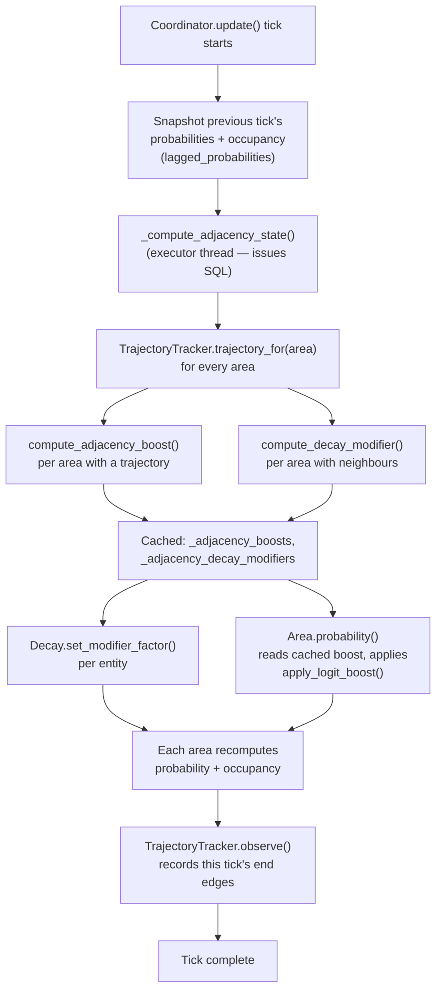

# Transition Learning

Technical reference for the adjacent-areas feature (discussion [#431](https://github.com/Hankanman/Area-Occupancy-Detection/discussions/431), PR [#454](https://github.com/Hankanman/Area-Occupancy-Detection/pull/454)). Covers how transitions between adjacent areas are detected, stored, and looked up, and how the result feeds into the Bayesian probability and decay calculations. For the user-facing behaviour, see [Adjacent Areas](../features/adjacent-areas.md).

## Storage: the `AreaTransitions` table

Each row records how many times a chain of areas was observed, bucketed by time of day:

```
(entry_id, from_area, mid_area, to_area, hour_of_week, count, updated_at)
```

- **`from_area` is the oldest hop, `to_area` is the prediction target.** For a chain `W → X → Y`, the row is stored with `from_area=W`, `mid_area=X`, `to_area=Y` — i.e. the row answers "given we came from `from_area` via `mid_area`, what's the probability of ending up at `to_area`?"
- **`mid_area=""` is the 1-hop sentinel.** A direct `X → Y` transition (no known second hop) is stored as `from_area=X, mid_area="", to_area=Y`. An empty string is used instead of `NULL` because `NULL` doesn't participate in SQL uniqueness the same way `NULL != NULL` — the sentinel keeps the unique constraint on `(entry_id, from_area, mid_area, to_area, hour_of_week)` actually enforcing per-chain uniqueness.
- **`count` is a float**, not an integer, because it's exponentially decayed in place each learning cycle (see below) rather than only ever incremented.

Only chains where every link is a currently-configured adjacent pair are recorded — transitions through rooms that aren't configured as adjacent in this household are never counted, keeping the table sparse and relevant to this installation's actual layout.

## Detection

Transition detection runs once per hourly analysis cycle, in `db/transitions.py`, as its own pipeline step (`transition_learning`, between `correlation_analysis` and `pipeline_health_check`).

1. **Read the adjacency index** — `build_adjacency_index()` reads `AreaRelationships` rows with `relationship_type == "adjacent"` into `{area: {neighbour, ...}}`.
2. **Collect interval boundaries** since the last watermark — every configured area's occupied intervals contribute a start and an end event; only events whose end lands after the watermark are new.
3. **Walk the timeline** (`_detect_transitions`) maintaining a small rolling deque of recent area-end events pruned by the trajectory window:
   - A 1-hop transition `(X, "", Y, hour)` is emitted when area `X` ended and area `Y` started within **`ADJACENCY_TRANSITION_WINDOW_S` (60s)** of each other, and `Y` is in `X`'s configured adjacents.
   - A 2-hop transition `(W, X, Y, hour)` is additionally emitted when the prior `W → X` end-to-end gap also fits within **`ADJACENCY_TRAJECTORY_WINDOW_S` (300s)** and `W → X` is itself an adjacent pair.
   - `hour` is the hour-of-week bucket (below) of the event that completed the chain.
4. **Apply recency decay**, then **upsert the new counts**, then **advance the watermark** — all three in one DB transaction, so a mid-write failure rolls back cleanly and the next cycle retries the same window rather than double-counting.

### Hour-of-week bucketing

Chains are bucketed into 168 buckets — `weekday × 24 + hour` (0–167) — computed from the local timezone, mirroring the scheme used for time priors. This lets "morning study → hall → bathroom" learn separately from "evening study → hall → bedroom" without needing separate tables.

### Recency decay

Before each cycle's new observations are added, every existing count for the entry is multiplied by:

```
factor = 0.5 ^ (hours_since_last_run / (24 × ADJACENCY_RECENCY_HALF_LIFE_DAYS))
```

With the default half-life of **30 days**, a count roughly halves every month it isn't reinforced by new observations — so the model gradually forgets old patterns and adapts to a changing household routine.

## Lookup: six-level smoothing fallback

`lookup_transition_probability()` in `db/transitions.py` answers `P(to_area | from_area, mid_area, hour_of_week)`. Sparse data is the norm — most chain/hour combinations won't have enough observations to trust — so the lookup progressively widens its scope until a level has enough total observations, walking through:

| Level | Scope | Threshold constant | Value |
|---|---|---|---|
| 1. `2hop_hour_of_week` | Specific 2-hop chain, exact hour-of-week | `ADJACENCY_N_SPECIFIC` | 5 |
| 2. `2hop_hour_of_day` | Specific 2-hop chain, hour-of-day (weekdays collapsed) | `ADJACENCY_N_HOUR` | 20 |
| 3. `2hop_unbucketed` | Specific 2-hop chain, all hours pooled | `ADJACENCY_N_CHAIN` | 50 |
| 4. `1hop_hour_of_week` | Equivalent 1-hop chain, exact hour-of-week | `ADJACENCY_N_SPECIFIC` | 5 |
| 5. `1hop_unbucketed` | Equivalent 1-hop chain, all hours pooled | `ADJACENCY_N_PAIR` | 20 |
| 6. `static_default` | No sufficient data at any level | — | `DEFAULT_INFLUENCE_WEIGHTS["adjacent"]` (0.3) |

The threshold is checked against the **total** observations at that level (all destinations from the same source), not just the observed count for the specific `to_area` — once a level is trusted, an unobserved destination there is treated as a genuine zero rather than "no data yet". Callers that don't yet have a 2-hop trajectory pass `mid_area=""`, which skips straight to level 4.

Each `TransitionLookupResult` carries the `probability`, the `level` that supplied it, and the `observed`/`total` counts — surfaced directly in diagnostics so you can see which fallback fired for any given prediction.

## Runtime wiring: boost and decay modifier

Two consumers read `lookup_transition_probability()` every coordinator tick, via a shared `TrajectoryTracker` (`data/trajectory.py`) that maintains a rolling deque of recent area-end events household-wide and hands back a `Trajectory(prev_area, prev_prev_area, hour_of_week)` for any target area.

### Boost — `compute_adjacency_boost()` (`data/adjacency.py`)

Applied in `Area.probability()`, **after** the sensor-only Bayesian probability and any activity boost, via `apply_logit_boost()` (`clamp → logit → add → sigmoid → clamp`, in logit space):

```
logit_contribution = gain × logit(P(target_area | trajectory, hour))
new_probability = sigmoid(logit(current_probability) + logit_contribution)
```

`gain` is **`ADJACENCY_BOOST_GAIN` = 0.5**. `P(target_area | trajectory, hour)` comes from the lookup above, using the household's most recent 1 or 2 hops as `from_area`/`mid_area`. `logit(0.5) = 0`, so a static-default lookup (~0.3) still contributes a small non-zero nudge rather than a large one — the boost is naturally weak until real data has been learned. No trajectory (`prev_area is None`) means no boost at all.

### Decay modifier — `compute_decay_modifier()` (`data/adjacency.py`)

Applied in `Decay.half_life` (`data/decay.py`) via `Decay.set_modifier_factor()`, which the coordinator calls once per tick for every entity in an area with configured neighbours:

```
silence_score = Σ_X∈adjacent(target) ( (1 − P_X_lagged) × P(target → X | trajectory, hour) )
decay_modifier = min(1 + gain × silence_score, cap)
effective_half_life = base_half_life × decay_modifier
```

`gain` is **`ADJACENCY_DECAY_MODIFIER_GAIN` = 0.75**, `cap` is **`ADJACENCY_DECAY_MODIFIER_MAX` = 1.75**. Intuitively: each neighbour `X` contributes to the silence score in proportion to how likely the household is to leave `target` via `X` **and** how confidently `X` is currently unoccupied. A bedroom whose only learned exit (a hall) has stayed silent gets close to the full 1.75× slowdown; a hub room whose exits spread across several neighbours gets a smaller modifier because no single exit dominates the sum. `silence_score` is clamped to `[0, 1]` before the modifier is computed, regardless of how many neighbours an area has. The modifier only ever stretches decay (`Decay.set_modifier_factor` clamps to `≥ 1.0`) — it never speeds it up.

### Lagged-probability feedback avoidance

Both the boost and the decay modifier read *last tick's* per-area probabilities (`coordinator.lagged_probabilities`), captured at the start of `update()` before any area recomputes. Reading the in-progress tick's own outputs instead would let an area's adjacency contribution feed back on itself within the same update — a neighbour that just got boosted could then look "occupied" and further boost/slow-decay back, compounding within a single tick. Lagging by one tick breaks that loop.

## Per-tick data flow



The SQL-issuing lookup runs once per tick in the executor pool (`_compute_adjacency_state`), reusing a single adjacency-index read across every area, so the event loop is never blocked by transition queries.

## Tunables

All constants live in `const.py` and are not currently exposed in the UI — see the [Adjacent Areas FAQ](../features/adjacent-areas.md#faq).

| Constant | Value | Meaning |
|---|---|---|
| `ADJACENCY_TRANSITION_WINDOW_S` | 60 | Max gap between one area ending and the next starting to count as a transition |
| `ADJACENCY_TRAJECTORY_WINDOW_S` | 300 | How far back the rolling trajectory window looks for recent-history slots |
| `ADJACENCY_RECENCY_HALF_LIFE_DAYS` | 30 | Half-life for exponential decay of transition counts each learning cycle |
| `ADJACENCY_BOOST_GAIN` | 0.5 | `k` — multiplier on the logit-space boost |
| `ADJACENCY_DECAY_MODIFIER_GAIN` | 0.75 | `α` — multiplier on the silence score |
| `ADJACENCY_DECAY_MODIFIER_MAX` | 1.75 | Cap on `effective_half_life / base_half_life` |
| `ADJACENCY_N_SPECIFIC` | 5 | Trust threshold for the 2-hop/1-hop exact-hour levels |
| `ADJACENCY_N_HOUR` | 20 | Trust threshold for the 2-hop hour-of-day level |
| `ADJACENCY_N_CHAIN` | 50 | Trust threshold for the 2-hop unbucketed level |
| `ADJACENCY_N_PAIR` | 20 | Trust threshold for the 1-hop unbucketed level |

## Diagnostics

The [diagnostics export](diagnostics.md) includes an `adjacency` block (`boost` and/or `decay_modifier`) under each area's `current` section, populated from `diagnostics.py::_adjacency_snapshot()`. It surfaces the exact trajectory, hour bucket, fallback level, raw probability, and logit contribution (for the boost), or the silence score, decay multiplier, and per-neighbour breakdown of `(neighbour, lagged_probability, transition_probability)` (for the decay modifier) — the same values used in the calculations above.

## Out of scope

- Trajectories longer than 2 hops.
- `relationship_type` values other than `"adjacent"` (the schema supports them; nothing populates them yet).
- Per-pair or per-area tuning of `gain`/`cap` from the UI — the constants above are global and fixed in code.
